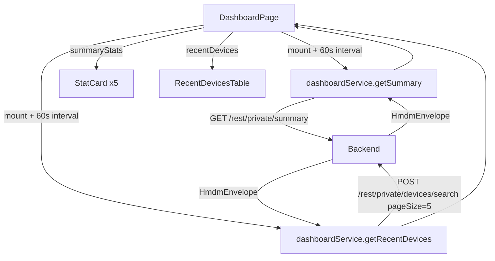

# Design Document: Dashboard Improvements

## Overview

The Dashboard Improvements feature replaces the current placeholder `DashboardPage` with a fully functional, data-driven overview page. It displays five summary statistic cards fetched from `GET /rest/private/summary`, a recent devices table showing the 5 most recently updated devices, loading skeletons during initial fetch, and auto-refreshes every 60 seconds.

All data flows through a dedicated `dashboardService` module that wraps the shared `apiClient`. The UI is built exclusively from shadcn/ui components (`Card`, `Skeleton`, `Badge`, `Table`) following the same patterns established by the existing devices and auth pages.

### Key Design Decisions

- **Auto-refresh strategy**: Use `setInterval` inside a `useEffect` with a cleanup function. The interval fires every 60 seconds and calls the same fetch functions. During background refresh, previously loaded data stays visible (no skeleton flash).
- **Recent devices API**: Reuses `POST /rest/private/devices/search` with `pageSize: 5` sorted by `lastUpdate` descending — the same endpoint used by the devices management feature.
- **Service layer**: A new `dashboardService.ts` owns both the summary fetch and the recent-devices fetch, keeping `DashboardPage` free of raw HTTP logic.
- **Error handling**: Initial load errors replace the skeleton with an error banner. Background refresh errors are silently ignored to avoid disrupting the currently displayed data.

---

## Architecture

The feature follows the existing feature-slice pattern:

```
src/features/dashboard/
  DashboardPage.tsx       # Page component, route /dashboard
  dashboardService.ts     # API calls via apiClient
  types.ts                # TypeScript interfaces
```

No new shadcn/ui components need to be scaffolded — `Card`, `Skeleton`, `Badge`, and `Table` are already present in `src/shared/ui/`.

### Data Flow



---

## Components and Interfaces

### DashboardPage

Top-level page component rendered at `/dashboard`. Owns all state:

| State | Type | Purpose |
|---|---|---|
| `summary` | `SummaryStats \| null` | Fetched summary statistics |
| `recentDevices` | `RecentDeviceRow[]` | Last 5 devices by lastUpdate |
| `loading` | `boolean` | True only during initial fetch (not background refresh) |
| `error` | `string \| null` | Error from initial fetch |

On mount: set `loading = true`, fetch both endpoints in parallel via `Promise.all`, set `loading = false` on completion. Start a 60-second interval that re-fetches both endpoints without touching `loading` state. Clear the interval on unmount.

### StatCard

Inline component (no separate file needed). Renders a shadcn/ui `Card` with:
- An icon (Lucide React icon passed as prop)
- A numeric value (or `Skeleton` while loading)
- A text label

Props: `label: string`, `value: number | null`, `icon: React.ReactNode`, `loading: boolean`

### RecentDevicesTable

Inline component. Renders a shadcn/ui `Table` with columns: Device Name, Last Seen, Status. Shows `Skeleton` rows while loading. Uses `StatusBadge` logic (inline or imported from devices feature) to render online/offline `Badge`.

---

## Data Models

### Frontend Types (`src/features/dashboard/types.ts`)

```typescript
// Response from GET /rest/private/summary
export interface SummaryStats {
  deviceTotal: number
  deviceOnline: number
  deviceEnrolled: number
  configurationCount: number
  applicationCount: number
}

// Minimal device shape needed for the recent devices table
// Sourced from POST /rest/private/devices/search response items
export interface RecentDeviceRow {
  id: number
  number: string
  description: string | null
  statusCode: string | null   // "green" = online, "red" = offline, other = unknown
  lastUpdate: number | null   // Unix ms
}
```

### API Response Shapes

```typescript
// GET /rest/private/summary
// Wrapped in HmdmEnvelope<SummaryStats>
// { status: "OK", data: { deviceTotal, deviceOnline, deviceEnrolled, configurationCount, applicationCount } }

// POST /rest/private/devices/search (pageSize=5, sorted by lastUpdate desc)
// Wrapped in HmdmEnvelope<DeviceListResponse>
// { status: "OK", data: { devices: { items: DeviceView[], totalItemsCount: number }, configurations: {} } }
```

### dashboardService (`src/features/dashboard/dashboardService.ts`)

```typescript
import apiClient from '@/services/apiClient'
import { HmdmEnvelope, unwrapHmdmData } from '@/services/hmdmEnvelope'
import type { SummaryStats, RecentDeviceRow } from './types'

export async function getSummary(): Promise<SummaryStats>
export async function getRecentDevices(): Promise<RecentDeviceRow[]>
```

`getSummary` calls `GET /rest/private/summary` and unwraps via `unwrapHmdmData`.

`getRecentDevices` calls `POST /rest/private/devices/search` with `{ pageNum: 1, pageSize: 5 }` and maps the response items to `RecentDeviceRow[]`. Sorting by `lastUpdate` descending is requested via the API body (same pattern as devices management).

---

## Correctness Properties

*A property is a characteristic or behavior that should hold true across all valid executions of a system — essentially, a formal statement about what the system should do. Properties serve as the bridge between human-readable specifications and machine-verifiable correctness guarantees.*

### Property 1: Stat card values match API response

*For any* valid `SummaryStats` object returned by the API, each of the five `StatCard` components must display the exact corresponding numeric value: `deviceTotal`, `deviceOnline`, `deviceEnrolled`, `configurationCount`, and `applicationCount`.

**Validates: Requirements 1.2, 5.2**

### Property 2: Recent devices sorted by lastUpdate descending

*For any* list of device records returned by the API, the rows rendered in the `RecentDevicesTable` must appear in descending order of `lastUpdate` — the device with the highest `lastUpdate` value must appear first.

**Validates: Requirements 2.2**

### Property 3: Device row renders required fields

*For any* `RecentDeviceRow` object, the rendered table row must contain the device name (number/description), a formatted `lastUpdate` value, and a status badge.

**Validates: Requirements 2.3**

### Property 4: Badge correctly reflects online status

*For any* `RecentDeviceRow`, when `statusCode` is `"green"` the rendered badge must indicate "Online", and when `statusCode` is `"red"` the rendered badge must indicate "Offline". For any other `statusCode` value the badge must indicate "Unknown".

**Validates: Requirements 2.4, 2.5**

### Property 5: Auto-refresh re-fetches after 60 seconds

*For any* mounted `DashboardPage`, after 60 seconds have elapsed since the last fetch, `dashboardService.getSummary` and `dashboardService.getRecentDevices` must each be called again without any user interaction.

**Validates: Requirements 4.2**

### Property 6: Previously loaded data shown during background refresh

*For any* `DashboardPage` that has successfully loaded data at least once, when a background refresh fetch is in progress, the previously loaded summary values and device rows must remain visible — no `Skeleton` components should be rendered.

**Validates: Requirements 4.4**

### Property 7: Fetch failure shows error message

*For any* fetch attempt where the API returns a non-2xx status or a network error occurs, the `DashboardPage` must display a visible error message and must not display the data from a previous successful fetch as if it were current.

**Validates: Requirements 5.4, 5.5**

---

## Error Handling

| Scenario | Behavior |
|---|---|
| Initial summary fetch fails | Show error banner; stat card skeletons replaced with error state |
| Initial devices fetch fails | Show error banner; table skeleton replaced with error state |
| Background refresh fails | Silently ignored; previously loaded data remains displayed |
| 401 on any call | `apiClient` interceptor clears token and redirects to `/login` |
| `data` field null in envelope | `unwrapHmdmData` throws; treated as fetch failure |
| Empty devices list | Table renders with zero rows and a "No recent devices" message |

---

## Testing Strategy

### Dual Testing Approach

Both unit tests and property-based tests are required. They are complementary:
- Unit tests cover specific examples, loading states, and error conditions
- Property tests verify universal correctness across randomized inputs

### Unit Tests (Vitest + React Testing Library)

Focus areas:
- `DashboardPage` renders 5 stat card skeletons while loading
- `DashboardPage` renders table row skeletons while loading
- `DashboardPage` shows error banner when initial fetch fails
- `DashboardPage` shows loaded data after successful fetch
- `DashboardPage` calls `clearInterval` on unmount (memory leak prevention)
- `dashboardService.getSummary` sends GET to `/rest/private/summary`
- `dashboardService.getRecentDevices` sends POST to `/rest/private/devices/search` with `pageSize: 5`
- `dashboardService` unwraps `HmdmEnvelope` and throws on non-OK status

### Property-Based Tests (fast-check)

Each property test runs a minimum of 100 iterations. Each test is tagged with a comment referencing the design property.

```
// Feature: dashboard-improvements, Property 1: Stat card values match API response
// Feature: dashboard-improvements, Property 2: Recent devices sorted by lastUpdate descending
// Feature: dashboard-improvements, Property 3: Device row renders required fields
// Feature: dashboard-improvements, Property 4: Badge correctly reflects online status
// Feature: dashboard-improvements, Property 5: Auto-refresh re-fetches after 60 seconds
// Feature: dashboard-improvements, Property 6: Previously loaded data shown during background refresh
// Feature: dashboard-improvements, Property 7: Fetch failure shows error message
```

**Generators needed**:
- `fc.record({ deviceTotal: fc.nat(), deviceOnline: fc.nat(), deviceEnrolled: fc.nat(), configurationCount: fc.nat(), applicationCount: fc.nat() })` for Property 1
- `fc.array(arbitraryRecentDeviceRow(), { minLength: 1, maxLength: 5 })` with shuffled `lastUpdate` values for Property 2
- `arbitraryRecentDeviceRow()` with nullable `description` and `lastUpdate` for Property 3
- `fc.oneof(fc.constant("green"), fc.constant("red"), fc.string())` for Property 4
- Fake timers (`vi.useFakeTimers`) + `fc.integer({ min: 1, max: 10 })` refresh cycles for Property 5
- `fc.record({ httpStatus: fc.integer({ min: 400, max: 599 }) })` for Property 7
