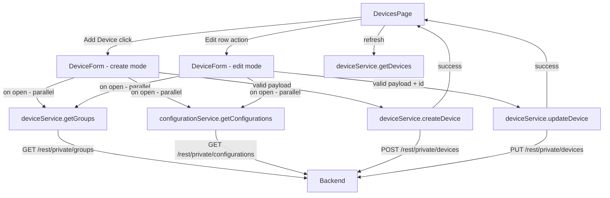

# Design Document: Devices Add/Edit

## Overview

This feature extends the existing `DevicesPage` and `deviceService` with the ability to create and edit devices. A single `DeviceForm` component handles both modes — create and edit — inside a shadcn/ui `Dialog`. The form uses `react-hook-form` + `zod` for validation, fetches groups and configurations in parallel on open, and calls the appropriate service function on submit. On success it invokes an `onSuccess` callback that triggers a list refresh in `DevicesPage`.

The implementation follows the exact same patterns established by `ConfigurationForm` (configurations-management) and `UserForm` (users-management).

### Key Backend API Findings

- **Create device**: `POST /rest/private/devices` — body is a `DevicePayload`; response is `{ status: "OK" | "ERROR", data: DeviceView }`
- **Update device**: `PUT /rest/private/devices` — body is a `DevicePayload` including `id`; response is `{ status: "OK" | "ERROR" }` (data may be empty)
- **Groups list**: `GET /rest/private/groups` — returns `LookupItem[]` (already typed in `types.ts`)
- **Configurations list**: `GET /rest/private/configurations` — returns `Configuration[]` (already typed in configurations feature)
- **Response shape**: all responses wrapped in `{ status: "OK" | "ERROR", data: T }` — unwrapped via `unwrapHmdmData` / `assertHmdmOk` from `src/services/hmdmEnvelope.ts`
- **`number` field**: device ID string — required on create, read-only on edit (backend ignores changes to `number` on PUT)
- **`groups`**: sent as `LookupItem[]` (array of `{ id, name }`) — same shape as stored on `DeviceView`

---

## Architecture

No new directories are needed. All new files live inside the existing `src/features/devices/` slice:

```
src/features/devices/
  DeviceForm.tsx          # NEW — Dialog form (create + edit modes)
  deviceService.ts        # EXTENDED — add createDevice; updateDevice already exists
  types.ts                # EXTENDED — add DevicePayload, GroupView
```

All required shadcn/ui components are already present in `src/shared/ui/`:
`Dialog`, `Form`, `Input`, `Textarea`, `Select`, `Button`, `Skeleton`, `Label`, `Checkbox` (via Radix).

For the multi-select group picker, a `Command`-based popover (shadcn/ui `Command` + `Popover`) is the idiomatic choice. If `command.tsx` and `popover.tsx` are not yet scaffolded, they must be added.

### Data Flow



---

## Components and Interfaces

### DevicesPage changes

Two new state variables are added:

| State | Type | Purpose |
|---|---|---|
| `formMode` | `'create' \| 'edit' \| null` | Controls `DeviceForm` dialog visibility |
| `deviceToEdit` | `DeviceView \| null` | Device being edited; null in create mode |

The existing `RowActionsMenu` gains an "Edit" item that sets `deviceToEdit` and `formMode = 'edit'`. The "Add Device" button sets `formMode = 'create'` and `deviceToEdit = null`.

### DeviceForm

Rendered inside a shadcn/ui `Dialog`. Accepts:

| Prop | Type | Purpose |
|---|---|---|
| `mode` | `'create' \| 'edit'` | Controls title, `number` editability, and submit action |
| `initialData` | `DeviceView \| null` | Pre-populates fields in edit mode |
| `onSuccess` | `() => void` | Called after successful submit; triggers list refresh |
| `onClose` | `() => void` | Called on cancel or after success |

Internal state:

| State | Type | Purpose |
|---|---|---|
| `submitting` | `boolean` | Submit request in flight |
| `submitError` | `string \| null` | Error from last submit attempt |
| `groups` | `LookupItem[]` | Available groups from API |
| `groupsLoading` | `boolean` | Groups fetch in flight |
| `groupsError` | `string \| null` | Groups fetch error |
| `configurations` | `ConfigurationOption[]` | Available configurations from API |
| `configurationsLoading` | `boolean` | Configurations fetch in flight |
| `configurationsError` | `string \| null` | Configurations fetch error |

On mount, `getGroups()` and `getConfigurations()` are called in parallel via `Promise.all`.

**Form fields:**

| Field | Component | Validation | Create | Edit |
|---|---|---|---|---|
| `number` | `Input` | Required, non-empty | Editable | Disabled |
| `description` | `Textarea` | Optional | ✓ | ✓ |
| `configurationId` | `Select` (Configuration_Selector) | Optional | ✓ | Pre-selected |
| `groups` | Multi-checkbox popover (Group_Selector) | Optional | ✓ | Pre-selected |
| `imei` | `Input` | Optional; if non-empty must be exactly 15 digits | ✓ | ✓ |
| `phone` | `Input` | Optional | ✓ | ✓ |
| `custom1` | `Input` | Optional | ✓ | ✓ |
| `custom2` | `Input` | Optional | ✓ | ✓ |
| `custom3` | `Input` | Optional | ✓ | ✓ |

### Group_Selector

A multi-select implemented as a `Popover` containing a scrollable list of `Checkbox` items — one per group. Selected group names are shown as a comma-separated summary in the trigger button. This avoids introducing a heavy combobox dependency and matches the shadcn/ui patterns already in use.

### Configuration_Selector

A standard shadcn/ui `Select` with one `SelectItem` per configuration plus a "None" option (value `""`). Maps to `configurationId: number | null` in the form values.

---

## Data Models

### Extended Types (`src/features/devices/types.ts`)

```typescript
// Body for POST /rest/private/devices (create) and PUT /rest/private/devices (update)
export interface DevicePayload {
  id?: number              // required for update, omitted for create
  number: string
  description?: string | null
  configurationId?: number | null
  groups?: LookupItem[]
  imei?: string | null
  phone?: string | null
  custom1?: string | null
  custom2?: string | null
  custom3?: string | null
}

// Lightweight option for the configuration selector
export interface ConfigurationOption {
  id: number
  name: string
}
```

### Extended Device Service (`src/features/devices/deviceService.ts`)

```typescript
// New function
export async function createDevice(payload: DevicePayload): Promise<void> {
  const response = await apiClient.post<HmdmEnvelope<unknown>>('/private/devices', payload)
  assertHmdmOk(response.data, 'Failed to create device.')
}

// New function for groups
export async function getGroups(): Promise<LookupItem[]> {
  const response = await apiClient.get<HmdmEnvelope<LookupItem[]>>('/private/groups')
  return unwrapHmdmData(response.data, 'Failed to load groups.')
}
```

The existing `updateDevice` is already implemented but accepts a full `DeviceView`. It will be kept as-is; `DeviceForm` constructs the payload by merging form values with `initialData.id`.

### Zod Schema (inside DeviceForm)

```typescript
const deviceSchema = z.object({
  number: z.string().min(1, 'Device ID is required'),
  description: z.string().optional(),
  configurationId: z.number().nullable().optional(),
  groups: z.array(z.object({ id: z.number(), name: z.string().nullable() })).optional(),
  imei: z.string()
    .refine(v => !v || /^\d{15}$/.test(v), { message: 'IMEI must be exactly 15 digits' })
    .optional(),
  phone: z.string().optional(),
  custom1: z.string().optional(),
  custom2: z.string().optional(),
  custom3: z.string().optional(),
})
```

### API Response Wrapping

All responses use the `{ status: "OK" | "ERROR", data: T }` envelope. The service uses `assertHmdmOk` for void responses and `unwrapHmdmData` for responses with a payload, consistent with all other services in the project.

---

## Correctness Properties

*A property is a characteristic or behavior that should hold true across all valid executions of a system — essentially, a formal statement about what the system should do.*

### Property 1: Edit mode pre-populates all fields for any device

*For any* `DeviceView` object, opening `DeviceForm` in edit mode must pre-populate `number`, `description`, `configurationId`, `groups`, `imei`, `phone`, `custom1`, `custom2`, and `custom3` with that device's current values (null fields render as empty strings or empty selections).

**Validates: Requirements 2.2, 3.1–3.7**

### Property 2: Create mode submit calls POST with form values

*For any* valid `DevicePayload` (non-empty `number`, optional fields), submitting the form in create mode must call `deviceService.createDevice` with exactly those values — no `id` field included.

**Validates: Requirements 5.1, 10.1**

### Property 3: Edit mode submit calls PUT with form values and device id

*For any* `DeviceView` and any valid updated form values, submitting the form in edit mode must call `deviceService.updateDevice` with a payload that includes the original `device.id` and the updated field values.

**Validates: Requirements 6.1, 10.2**

### Property 4: Required field validation rejects empty or whitespace number

*For any* form submission where `number` is empty or composed entirely of whitespace, the form must reject the submission, display a validation error adjacent to the `number` field, and make no API call.

**Validates: Requirements 4.1**

### Property 5: IMEI validation accepts 15-digit strings and rejects all others

*For any* non-empty string that is not exactly 15 ASCII digits, the form must reject the submission with an IMEI validation error. *For any* string of exactly 15 ASCII digits, the form must accept it. *For any* empty or absent IMEI, the form must accept it without error.

**Validates: Requirements 4.2, 4.4**

### Property 6: Cancel makes no API call

*For any* dialog state (create or edit mode, any field values), clicking Cancel must not trigger any call to `deviceService.createDevice` or `deviceService.updateDevice`.

**Validates: Requirements 7.1**

### Property 7: Group selector pre-selects assigned groups for any device

*For any* `DeviceView` with a non-empty `groups` array, opening `DeviceForm` in edit mode must render each group in that array as checked in the Group_Selector.

**Validates: Requirements 8.4**

### Property 8: Configuration selector pre-selects assigned configuration for any device

*For any* `DeviceView` with a non-null `configurationId`, opening `DeviceForm` in edit mode must render the matching configuration as selected in the Configuration_Selector.

**Validates: Requirements 9.4**

### Property 9: Service createDevice routes to correct URL for any payload

*For any* `DevicePayload`, `deviceService.createDevice` must issue `POST /rest/private/devices` with that payload as the request body.

**Validates: Requirements 10.1, 10.3**

### Property 10: Service updateDevice routes to correct URL for any payload

*For any* `DevicePayload` with an `id`, `deviceService.updateDevice` must issue `PUT /rest/private/devices` with that payload as the request body.

**Validates: Requirements 10.2, 10.3**

### Property 11: Service error propagation

*For any* `deviceService.createDevice` or `deviceService.updateDevice` call, when the underlying `apiClient` call rejects (non-2xx response or `status: "ERROR"` envelope), the service function must re-throw the error rather than swallowing it.

**Validates: Requirements 10.4**

### Property 12: Null-safe form rendering for any device with null optional fields

*For any* `DeviceView` where `description`, `imei`, `phone`, `custom1`, `custom2`, `custom3`, `groups`, or `configurationId` are absent or null, opening `DeviceForm` in edit mode must not throw a runtime error.

**Validates: Requirements 3.1–3.7**

---

## Error Handling

| Scenario | Behavior |
|---|---|
| Groups fetch fails | Group_Selector shows error message and remains disabled; form still renders |
| Configurations fetch fails | Configuration_Selector shows error message and remains disabled; form still renders |
| Create fails | Error message shown inside dialog; dialog stays open; submit button re-enabled |
| Update fails | Error message shown inside dialog; dialog stays open; submit button re-enabled |
| 401 on any call | `apiClient` interceptor clears token and redirects to `/login` |

All error messages use the error's `message` field if available, falling back to a generic string.

---

## Testing Strategy

### Dual Testing Approach

Both unit tests and property-based tests are required and complementary:
- Unit tests cover specific examples, integration points, and error states
- Property tests verify universal correctness across randomized inputs

### Unit Tests (Vitest + React Testing Library)

Focus areas:
- `DevicesPage` renders "Add Device" button
- `DevicesPage` opens `DeviceForm` in create mode with empty fields when "Add Device" is clicked
- `DevicesPage` opens `DeviceForm` in edit mode pre-populated when "Edit" row action is clicked
- `DeviceForm` in create mode: `number` field is editable; title is "Add Device"
- `DeviceForm` in edit mode: `number` field is disabled; title is "Edit Device"
- `DeviceForm` calls `getGroups` and `getConfigurations` on mount
- `DeviceForm` disables submit button while submitting; re-enables on failure
- `DeviceForm` shows error message on submit failure; dialog stays open
- `DeviceForm` calls `onSuccess` and `onClose` on successful submit
- `DeviceForm` calls `onClose` on Cancel without any API call
- `deviceService.createDevice` calls `POST /rest/private/devices` with payload
- `deviceService.getGroups` calls `GET /rest/private/groups`
- `deviceService` error propagation: mock a 500 response and assert the promise rejects

### Property-Based Tests (fast-check)

Each property test runs a minimum of 100 iterations. Each test is tagged with a comment referencing the design property.

```
// Feature: devices-add-edit, Property 1: Edit mode pre-populates all fields for any device
// Feature: devices-add-edit, Property 2: Create mode submit calls POST with form values
// Feature: devices-add-edit, Property 3: Edit mode submit calls PUT with form values and device id
// Feature: devices-add-edit, Property 4: Required field validation rejects empty or whitespace number
// Feature: devices-add-edit, Property 5: IMEI validation accepts 15-digit strings and rejects all others
// Feature: devices-add-edit, Property 6: Cancel makes no API call
// Feature: devices-add-edit, Property 7: Group selector pre-selects assigned groups for any device
// Feature: devices-add-edit, Property 8: Configuration selector pre-selects assigned configuration for any device
// Feature: devices-add-edit, Property 9: Service createDevice routes to correct URL for any payload
// Feature: devices-add-edit, Property 10: Service updateDevice routes to correct URL for any payload
// Feature: devices-add-edit, Property 11: Service error propagation
// Feature: devices-add-edit, Property 12: Null-safe form rendering for any device with null optional fields
```

**Generators needed**:
- `arbitraryDeviceView()` — `fc.record({ id: fc.integer({ min: 1 }), number: fc.string({ minLength: 1 }), description: fc.option(fc.string()), configurationId: fc.option(fc.integer({ min: 1 })), groups: fc.array(fc.record({ id: fc.integer({ min: 1 }), name: fc.option(fc.string()) })), imei: fc.option(fc.stringOf(fc.constantFrom('0','1','2','3','4','5','6','7','8','9'), { minLength: 15, maxLength: 15 })), phone: fc.option(fc.string()), custom1: fc.option(fc.string()), custom2: fc.option(fc.string()), custom3: fc.option(fc.string()), statusCode: fc.option(fc.string()) })`
- `arbitraryDevicePayload()` — same as above but without `id`, `statusCode`, `info`, `lastUpdate`
- `arbitraryValidImei()` — `fc.stringOf(fc.constantFrom('0','1','2','3','4','5','6','7','8','9'), { minLength: 15, maxLength: 15 })`
- `arbitraryInvalidImei()` — `fc.string().filter(s => s.length > 0 && !/^\d{15}$/.test(s))`
- `arbitraryEmptyOrWhitespace()` — `fc.stringOf(fc.constantFrom(' ', '\t', '\n'))` for Property 4
- `arbitraryLookupItem()` — `fc.record({ id: fc.integer({ min: 1 }), name: fc.option(fc.string()) })`
- `arbitraryDeviceViewWithNulls()` — same as `arbitraryDeviceView()` but all optional fields forced to `null` for Property 12

### shadcn/ui Components to Scaffold

| Component | Command | Status |
|---|---|---|
| `command.tsx` | `npx shadcn@latest add command` | Needed for Group_Selector popover |
| `popover.tsx` | `npx shadcn@latest add popover` | Needed for Group_Selector popover |
| `checkbox.tsx` | `npx shadcn@latest add checkbox` | Needed for Group_Selector items |

Run all three commands inside `frontend/`. All other required components (`Dialog`, `Form`, `Input`, `Textarea`, `Select`, `Button`, `Skeleton`, `Label`) are already present in `src/shared/ui/`.
