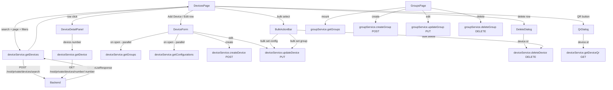

# Design Document: Devices Full

## Overview

This is the single authoritative design for all device-related functionality in the HMDM Modern Architecture frontend. It supersedes and consolidates the `devices-management` and `devices-add-edit` specs into one cohesive implementation covering: paginated device list, search, advanced filtering with full sort support, bulk actions (using dedicated bulk endpoints), add/edit form with advanced validation, device detail panel with full field coverage, status indicators (all 5 status codes), delete, QR code enrollment, configurable table columns (including computed status columns), application settings per device, auto-refresh (60s), description-only edit path, and a Groups management section.

All data flows through dedicated service modules (`deviceService`, `groupService`) that wrap the shared `apiClient` with automatic `X-Auth-Token` injection. The UI is built exclusively from shadcn/ui components following the patterns established by `configurations-management` and `users-management`.

### Key Backend API Facts

- **List**: `POST /rest/private/devices/search` — body: `DeviceSearchRequest` (full filter/sort support); pagination is **1-based** (`pageNum`)
- **Get device**: `GET /rest/private/devices/number/{number}` — lookup by device **number** string, not numeric id
- **Create**: `POST /rest/private/devices` — body: `DevicePayload` (no `id`)
- **Update**: `PUT /rest/private/devices` — body: `DevicePayload` with `id`
- **Delete single**: `DELETE /rest/private/devices/{id}` — numeric id
- **Bulk delete**: `POST /rest/private/devices/deleteBulk` — body: `{ ids: number[] }`
- **Bulk group**: `POST /rest/private/devices/groupBulk` — body: `GroupBulkPayload`
- **Groups**: `GET/POST/PUT/DELETE /rest/private/groups`
- **QR**: `GET /rest/private/devices/{id}/qr` — returns QR image data
- **App settings**: `GET/POST /rest/private/devices/{id}/applicationSettings`
- **App settings notify**: `POST /rest/private/devices/{id}/applicationSettings/notify`
- **Description only**: `POST /rest/private/devices/{id}/description`
- **Autocomplete**: `POST /rest/private/devices/autocomplete`
- **statusCode**: a **string** — `"green"` = Online, `"red"` = Offline, `"yellow"` = Warning, `"brown"` = Inactive, `"grey"` / others = Unknown
- **Response envelope**: all responses wrapped in `{ status: "OK" | "ERROR", data: T }` — unwrapped via `unwrapHmdmData` / `assertHmdmOk`

---

## Architecture

The feature follows the existing feature-slice pattern. All new files live inside `src/features/devices/` and `src/features/groups/`:

```
src/features/devices/
  DevicesPage.tsx          # Page component, route /devices
  DeviceForm.tsx           # Dialog form (create + edit modes, advanced validation)
  DeviceDetailPanel.tsx    # Sheet side panel for device details (full field coverage)
  DeleteDialog.tsx         # AlertDialog confirmation for delete
  StatusBadge.tsx          # Colored badge — all 5 status codes + rich tooltip
  BulkActionBar.tsx        # Toolbar shown when rows are selected
  QrDialog.tsx             # Dialog showing QR code for enrollment
  FilterPanel.tsx          # Collapsible advanced filter section (full filter set)
  AppSettingsDialog.tsx    # Dialog for per-device application settings
  deviceService.ts         # All device API calls (14 functions)
  types.ts                 # TypeScript interfaces (extended)

src/features/groups/
  GroupsPage.tsx           # Page component, route /groups
  groupService.ts          # All group API calls (4 functions)

src/shared/ui/             # shadcn/ui components to scaffold
  command.tsx              # npx shadcn@latest add command
  popover.tsx              # npx shadcn@latest add popover
  checkbox.tsx             # npx shadcn@latest add checkbox
  textarea.tsx             # npx shadcn@latest add textarea
  tooltip.tsx              # npx shadcn@latest add tooltip (for rich status tooltip)
```

Already present in `src/shared/ui/`: `table.tsx`, `badge.tsx`, `sheet.tsx`, `alert-dialog.tsx`, `dropdown-menu.tsx`, `skeleton.tsx`, `pagination.tsx`, `button.tsx`, `input.tsx`, `form.tsx`, `select.tsx`, `dialog.tsx`.

### Data Flow



---

## Components and Interfaces

### DevicesPage

Top-level page component rendered at `/devices`. Owns all state:

| State | Type | Purpose |
|---|---|---|
| `devices` | `DeviceView[]` | Current page of devices |
| `configurations` | `Record<string, ConfigurationView>` | Config lookup from API response |
| `total` | `number` | Total device count |
| `page` | `number` | Current page (1-based) |
| `pageSize` | `number` | Items per page (default 20) |
| `search` | `string` | Raw search input value |
| `debouncedSearch` | `string` | Debounced value (300ms) |
| `filters` | `DeviceFilters` | Active filter values (groupId, configurationId, status, androidVersion) |
| `loading` | `boolean` | List fetch in flight |
| `error` | `string \| null` | List fetch error |
| `selectedDevice` | `DeviceView \| null` | Device whose detail panel is open |
| `formMode` | `'create' \| 'edit' \| null` | Controls DeviceForm dialog visibility |
| `deviceToEdit` | `DeviceView \| null` | Device being edited; null in create mode |
| `deviceToDelete` | `DeviceView \| null` | Device pending deletion |
| `deviceForQr` | `DeviceView \| null` | Device for QR dialog |
| `selectedIds` | `Set<number>` | Selected device ids for bulk actions |
| `columnVisibility` | `ColumnVisibility` | Which optional columns are shown |
| `bulkAction` | `'delete' \| 'setConfig' \| 'setGroup' \| null` | Active bulk action dialog |

The page re-fetches whenever `debouncedSearch`, `page`, or `filters` changes. When any of these change (except page), `page` resets to 1. When page or filters change, `selectedIds` is cleared.

### DeviceDetailPanel

Renders inside a `Sheet` (side="right"). Props: `deviceNumber: string | null`, `onClose: () => void`. Manages its own `detail`, `detailLoading`, `detailError` state. Calls `deviceService.getDevice(number)` when `deviceNumber` changes.

### StatusBadge

Inline component. Props: `statusCode: string | null`, `lastUpdate: number | null`. Maps to Badge variant and label, and renders a rich tooltip:

| statusCode | variant | label |
|---|---|---|
| `"green"` | `default` (green) | Online |
| `"red"` | `destructive` | Offline |
| `"yellow"` | `warning` (amber) | Warning |
| `"brown"` | `orange` | Inactive |
| `"grey"` / null / other | `secondary` | Unknown |

The tooltip (via shadcn/ui `Tooltip`) shows:
- Line 1: humanized elapsed time (e.g., "3 hours ago", "2 days ago")
- Line 2: exact formatted timestamp

### DeviceForm

Rendered inside a shadcn/ui `Dialog`. Props:

| Prop | Type | Purpose |
|---|---|---|
| `mode` | `'create' \| 'edit'` | Controls title, number editability, submit action |
| `initialData` | `DeviceView \| null` | Pre-populates fields in edit mode |
| `onSuccess` | `() => void` | Called after successful submit |
| `onClose` | `() => void` | Called on cancel or after success |

Fetches groups and configurations in parallel on mount via `Promise.all`. Form fields:

| Field | Component | Validation | Create | Edit |
|---|---|---|---|---|
| `number` | `Input` | Required, non-empty | Editable | Disabled |
| `description` | `Textarea` | Optional | ✓ | ✓ |
| `configurationId` | `Select` (Configuration_Selector) | Optional | ✓ | Pre-selected |
| `groups` | Multi-checkbox `Popover` (Group_Selector) | Optional | ✓ | Pre-selected |
| `imei` | `Input` | Optional; if non-empty must be exactly 15 digits | ✓ | ✓ |
| `phone` | `Input` | Optional | ✓ | ✓ |
| `custom1` | `Input` | Optional | ✓ | ✓ |
| `custom2` | `Input` | Optional | ✓ | ✓ |
| `custom3` | `Input` | Optional | ✓ | ✓ |

### DeleteDialog

Wraps `AlertDialog`. Props: `device: DeviceView | null`, `onConfirm`, `onCancel`. Manages `deleting` and `deleteError` state internally. Shows device number in dialog body.

### BulkActionBar

Shown when `selectedIds.size > 0`. Displays count of selected devices and three action buttons: "Delete Selected", "Set Configuration", "Set Group". Each opens a confirmation dialog.

### FilterPanel

Collapsible section (collapsed by default). Contains: group filter `Select`, configuration filter `Select`, status filter `Select` (All/Online/Offline), Android version `Input` (debounced 300ms). Shows a badge count on the toggle button when any filter is active.

### QrDialog

Renders inside a `Dialog`. Props: `deviceId: number | null`, `onClose`. Calls `deviceService.getDeviceQr(id)` on open. Shows loading skeleton, then renders QR as `` with a "Download" button.

### Column Visibility

Managed as a simple state object in `DevicesPage`:

```typescript
type ColumnVisibility = {
  imei: boolean
  phone: boolean
  model: boolean
  battery: boolean
  android: boolean
  serial: boolean
  description: boolean
}
// Default: all false (hidden)
```

A `Column_Visibility_Menu` `DropdownMenu` button in the page header toggles individual columns. The Actions column is always visible and not listed in the menu.

### GroupsPage

Top-level page component rendered at `/groups`. Owns: `groups`, `loading`, `error`, `formMode`, `groupToEdit`, `groupToDelete` state. Fetches on mount and after any successful mutation. Renders a table with Group Name and Actions columns, an "Add Group" button, an inline form dialog, and a delete confirmation dialog.

---

## Data Models

### Types (`src/features/devices/types.ts`)

```typescript
export interface LookupItem {
  id: number
  name: string | null
}

export interface ConfigurationView {
  id: number
  name: string
}

export interface ConfigurationOption {
  id: number
  name: string
}

export interface DeviceInfoView {
  batteryLevel: number | null
  model: string | null
  imei: string | null
  phone: string | null
  androidVersion: string | null
  latitude: number | null
  longitude: number | null
  // Extended fields
  permissions: DevicePermissions | null
  applications: DeviceApplication[] | null
  files: DeviceFile[] | null
  defaultLauncher: boolean | null
  mdmMode: boolean | null
  kioskMode: boolean | null
  enrollTime: number | null
  publicIp: string | null
  launcherVersion: string | null
}

export interface DevicePermissions {
  // permission health fields from backend
  [key: string]: boolean | null
}

export interface DeviceApplication {
  id: number
  pkg: string
  version: string | null
  installed: boolean
}

export interface DeviceFile {
  id: number
  path: string
  present: boolean
  timestampMatch: boolean | null
}

export interface DeviceView {
  id: number
  number: string
  description: string | null
  configurationId: number | null
  groups: LookupItem[]
  statusCode: string | null        // "green" | "red" | others
  lastUpdate: number | null        // Unix ms
  info: DeviceInfoView | null
  androidVersion: string | null
  serial: string | null
  imei: string | null
  phone: string | null
  custom1: string | null
  custom2: string | null
  custom3: string | null
}

export interface DevicePayload {
  id?: number                      // required for update, omitted for create
  number: string
  description?: string | null
  configurationId?: number | null
  groups?: LookupItem[]
  imei?: string | null
  phone?: string | null
  custom1?: string | null
  custom2?: string | null
  custom3?: string | null
}

export interface DeviceSearchRequest {
  pageNum: number                  // 1-based
  pageSize: number
  value?: string
  groupId?: number
  configurationId?: number
  status?: string
  androidVersion?: string
  // Extended filter/sort fields
  sortBy?: string
  sortDir?: 'asc' | 'desc'
  dateFrom?: number
  dateTo?: number
  onlineEarlierMillis?: number
  onlineLaterMillis?: number
  enrollmentDateFrom?: number
  enrollmentDateTo?: number
  mdmMode?: boolean
  kioskMode?: boolean
  launcherVersion?: string
  installationStatus?: string
  imeiChanged?: boolean
  fastSearch?: boolean
}

export interface DeviceListResponse {
  devices: {
    items: DeviceView[]
    totalItemsCount: number
  }
  configurations: Record<string, ConfigurationView>
}

export interface DeviceFilters {
  groupId?: number
  configurationId?: number
  status?: string
  androidVersion?: string
  sortBy?: string
  sortDir?: 'asc' | 'desc'
  dateFrom?: number
  dateTo?: number
  onlineEarlierMillis?: number
  onlineLaterMillis?: number
  enrollmentDateFrom?: number
  enrollmentDateTo?: number
  mdmMode?: boolean
  kioskMode?: boolean
  launcherVersion?: string
  installationStatus?: string
  imeiChanged?: boolean
  fastSearch?: boolean
}

// Bulk operations
export interface BulkDeletePayload {
  ids: number[]
}

export interface GroupBulkPayload {
  ids: number[]
  action: 'set' | 'clear'
  groups: LookupItem[]
}

// Per-device application settings
export interface AppSetting {
  id?: number
  applicationId: number
  name: string
  value: string
  comment?: string
  readonly?: boolean
  lastUpdate?: number
}
```

### Device Service (`src/features/devices/deviceService.ts`)

```typescript
// Core CRUD
export async function getDevices(params: DeviceSearchRequest): Promise<DeviceListResponse>
export async function getDevice(number: string): Promise<DeviceView>
export async function createDevice(payload: DevicePayload): Promise<void>
export async function updateDevice(payload: DevicePayload): Promise<void>
export async function deleteDevice(id: number): Promise<void>

// Bulk operations (dedicated endpoints)
export async function deleteBulk(ids: number[]): Promise<void>
export async function groupBulk(payload: GroupBulkPayload): Promise<void>

// Lookups
export async function getGroups(): Promise<LookupItem[]>
export async function getConfigurations(): Promise<ConfigurationOption[]>

// QR enrollment
export async function getDeviceQr(id: number): Promise<string>

// Application settings
export async function getAppSettings(deviceId: number): Promise<AppSetting[]>
export async function saveAppSettings(deviceId: number, settings: AppSetting[]): Promise<void>
export async function notifyAppSettings(deviceId: number): Promise<void>

// Description-only edit
export async function updateDescription(deviceId: number, description: string): Promise<void>

// Autocomplete
export async function autocomplete(value: string): Promise<string[]>
```

All functions use the shared `apiClient`. `getDevices` calls `POST /rest/private/devices/search`. `getDevice` calls `GET /rest/private/devices/number/{number}`. `createDevice` calls `POST /rest/private/devices`. `updateDevice` calls `PUT /rest/private/devices`. `deleteDevice` calls `DELETE /rest/private/devices/{id}`. `getGroups` calls `GET /rest/private/groups`. `getConfigurations` calls `GET /rest/private/configurations`. `getDeviceQr` calls `GET /rest/private/devices/{id}/qr`.

All use `unwrapHmdmData` or `assertHmdmOk` from `src/services/hmdmEnvelope.ts`. Non-2xx responses or `status: "ERROR"` envelopes are re-thrown to the caller.

### Group Service (`src/features/groups/groupService.ts`)

```typescript
export async function getGroups(): Promise<LookupItem[]>
export async function createGroup(name: string): Promise<LookupItem>
export async function updateGroup(group: LookupItem): Promise<void>
export async function deleteGroup(id: number): Promise<void>
```

All functions use the shared `apiClient`. `getGroups` calls `GET /rest/private/groups`. `createGroup` calls `POST /rest/private/groups`. `updateGroup` calls `PUT /rest/private/groups`. `deleteGroup` calls `DELETE /rest/private/groups/{id}`.

### Zod Schema (inside DeviceForm)

```typescript
const deviceSchema = z.object({
  number: z.string().min(1, 'Device ID is required'),
  description: z.string().optional(),
  configurationId: z.number().nullable().optional(),
  groups: z.array(z.object({ id: z.number(), name: z.string().nullable() })).optional(),
  imei: z.string()
    .refine(v => !v || /^\d{15}$/.test(v), { message: 'IMEI must be exactly 15 digits' })
    .optional(),
  phone: z.string().optional(),
  custom1: z.string().optional(),
  custom2: z.string().optional(),
  custom3: z.string().optional(),
})
```

---

## Correctness Properties

*A property is a characteristic or behavior that should hold true across all valid executions of a system — essentially, a formal statement about what the system should do. Properties serve as the bridge between human-readable specifications and machine-verifiable correctness guarantees.*

### Property 1: Status badge mapping is total and correct

*For any* `statusCode` string value (including null), `StatusBadge` must render exactly one badge: labeled "Online" for `"green"`, labeled "Offline" for `"red"`, or labeled "Unknown" for all other values. No statusCode value should produce an unlabeled or missing badge.

**Validates: Requirements 5.1, 5.4**

### Property 2: Every device row contains a status badge

*For any* non-empty list of devices returned by the API, every row rendered in the Device_Table must contain a `StatusBadge` component.

**Validates: Requirements 5.2**

### Property 3: Search resets page to 1 and includes search term

*For any* current page state and any new search term, applying the search must reset the page number to 1 and include the `value` field in the API call. Clearing the search must reset to page 1 with no `value` field.

**Validates: Requirements 2.3, 2.4, 3.4**

### Property 4: Debounce collapses rapid inputs into one call

*For any* sequence of search input changes occurring within 300ms of each other, the API must be called at most once after the debounce period expires — not once per keystroke.

**Validates: Requirements 2.2, 13.6**

### Property 5: Pagination controls appear iff total exceeds page size

*For any* API response, pagination controls are rendered if and only if `totalItemsCount > pageSize`. The rendered text must include the current page number and the total device count.

**Validates: Requirements 3.1, 3.5**

### Property 6: Page navigation calls service with correct page number

*For any* page number N clicked in the pagination controls, `deviceService.getDevices` must be called with `pageNum: N`.

**Validates: Requirements 3.2**

### Property 7: Filter selection calls service with correct filter and resets page

*For any* filter value selected (groupId, configurationId, status, or androidVersion), `deviceService.getDevices` must be called with that filter value and `pageNum: 1`.

**Validates: Requirements 13.3, 13.4, 13.5, 13.6**

### Property 8: Active filter indicator shown for any active filter

*For any* filter state where at least one filter is non-empty, the Filter_Panel toggle must display a visual indicator (badge count or highlight). When all filters are cleared, the indicator must be absent.

**Validates: Requirements 13.9**

### Property 9: Detail panel fetches by device number

*For any* device row clicked, `deviceService.getDevice` must be called with that device's `number` field (not its numeric `id`).

**Validates: Requirements 4.2**

### Property 10: Detail panel renders all required fields for any device

*For any* `DeviceView` returned by the detail API, the rendered `DeviceDetailPanel` must display: device number, StatusBadge, configuration name, group names, battery level (or "N/A"), last update timestamp (formatted), and GPS coordinates or "Location unavailable".

**Validates: Requirements 4.4**

### Property 11: Delete dialog shows device number for any device

*For any* device, opening the Delete_Dialog must render that device's `number` in the dialog body.

**Validates: Requirements 6.1**

### Property 12: Delete confirmation calls service with correct id

*For any* device, when the user confirms deletion, `deviceService.deleteDevice` must be called with exactly that device's numeric `id`.

**Validates: Requirements 6.2**

### Property 13: Cancel delete makes no API call

*For any* device with the delete dialog open, clicking Cancel must not trigger any call to `deviceService.deleteDevice`.

**Validates: Requirements 6.6**

### Property 14: Create mode submit calls POST with form values and no id

*For any* valid `DevicePayload` (non-empty `number`, optional fields), submitting the form in create mode must call `deviceService.createDevice` with exactly those values — no `id` field included.

**Validates: Requirements 7.4**

### Property 15: Edit mode submit calls PUT with form values and device id

*For any* `DeviceView` and any valid updated form values, submitting the form in edit mode must call `deviceService.updateDevice` with a payload that includes the original `device.id` and the updated field values.

**Validates: Requirements 8.5**

### Property 16: Required field validation rejects empty or whitespace number

*For any* form submission where `number` is empty or composed entirely of whitespace, the form must reject the submission, display a validation error adjacent to the `number` field, and make no API call.

**Validates: Requirements 10.1**

### Property 17: IMEI validation accepts 15-digit strings and rejects all others

*For any* non-empty string that is not exactly 15 ASCII digits, the form must reject the submission with an IMEI validation error. For any string of exactly 15 ASCII digits, the form must accept it. For any empty or absent IMEI, the form must accept it without error.

**Validates: Requirements 10.2, 10.3**

### Property 18: Group selector pre-selects assigned groups for any device

*For any* `DeviceView` with a non-empty `groups` array, opening `DeviceForm` in edit mode must render each group in that array as checked in the Group_Selector.

**Validates: Requirements 11.4**

### Property 19: Configuration selector pre-selects assigned configuration for any device

*For any* `DeviceView` with a non-null `configurationId`, opening `DeviceForm` in edit mode must render the matching configuration as selected in the Configuration_Selector.

**Validates: Requirements 12.4**

### Property 20: Column toggle immediately shows or hides column

*For any* column in the optional column set, toggling it in the Column_Visibility_Menu must immediately show or hide that column in the Device_Table without a page reload.

**Validates: Requirements 14.4**

### Property 21: Actions column is always visible

*For any* column visibility configuration, the Actions column must always be present in the Device_Table and must not appear in the Column_Visibility_Menu.

**Validates: Requirements 14.5**

### Property 22: Select All selects all rows on current page

*For any* page of devices, checking the Select All checkbox must mark all rows on that page as selected, and the Bulk_Action_Bar must appear showing the correct count.

**Validates: Requirements 15.3, 15.5**

### Property 23: Page or filter change clears selection

*For any* selection state, when the page changes or a new search or filter is applied, all row selections must be cleared.

**Validates: Requirements 15.6**

### Property 24: Bulk delete calls DELETE for each selected device

*For any* non-empty set of selected device ids, confirming bulk delete must call `deviceService.deleteDevice` once for each id in the set.

**Validates: Requirements 16.3**

### Property 25: Bulk set configuration calls PUT for each selected device

*For any* non-empty set of selected device ids and any chosen configurationId, confirming bulk set configuration must call `deviceService.updateDevice` once for each selected device with the updated `configurationId`.

**Validates: Requirements 17.3**

### Property 26: Bulk set group calls PUT for each selected device

*For any* non-empty set of selected device ids and any chosen group, confirming bulk set group must call `deviceService.updateDevice` once for each selected device with the updated `groups` array.

**Validates: Requirements 18.3**

### Property 27: QR dialog fetches by device id

*For any* device, opening the QR_Dialog must call `deviceService.getDeviceQr` with that device's numeric `id`.

**Validates: Requirements 19.3**

### Property 28: Device service routes to correct URL for any operation

*For any* input to each service function, the correct HTTP method and URL must be used:
- `getDevices(params)` → `POST /rest/private/devices/search` with params as body
- `getDevice(number)` → `GET /rest/private/devices/number/{number}`
- `createDevice(payload)` → `POST /rest/private/devices` with payload as body
- `updateDevice(payload)` → `PUT /rest/private/devices` with payload as body
- `deleteDevice(id)` → `DELETE /rest/private/devices/{id}`
- `getGroups()` → `GET /rest/private/groups`
- `getConfigurations()` → `GET /rest/private/configurations`
- `getDeviceQr(id)` → `GET /rest/private/devices/{id}/qr`

**Validates: Requirements 20.1–20.8**

### Property 29: Device service error propagation

*For any* `deviceService` function, when the underlying `apiClient` call rejects (non-2xx response or `status: "ERROR"` envelope), the service function must re-throw the error rather than swallowing it.

**Validates: Requirements 20.10**

### Property 30: Null-safe rendering for any device with null optional fields

*For any* `DeviceView` where optional fields (`info`, `lastUpdate`, `groups`, `configurationId`, `description`, `imei`, `phone`, `custom1`, `custom2`, `custom3`, `serial`, `androidVersion`) are absent or null, rendering the device row, detail panel, and form must not throw a runtime error.

**Validates: Requirements 21.6**

### Property 31: Groups table columns rendered for any group list

*For any* non-empty array of `LookupItem` objects returned by the groups API, the rendered table must contain exactly the columns: Group Name and Actions.

**Validates: Requirements 22.3**

### Property 32: Group service routes to correct URL for any operation

*For any* input to each group service function, the correct HTTP method and URL must be used:
- `getGroups()` → `GET /rest/private/groups`
- `createGroup(name)` → `POST /rest/private/groups`
- `updateGroup(group)` → `PUT /rest/private/groups`
- `deleteGroup(id)` → `DELETE /rest/private/groups/{id}`

**Validates: Requirements 26.1–26.4**

### Property 33: Group service error propagation

*For any* `groupService` function, when the underlying `apiClient` call rejects, the service function must re-throw the error.

**Validates: Requirements 26.6**

### Property 34: DevicePayload serialization round-trip

*For any* valid `DevicePayload` object, serializing to JSON and deserializing back must produce an equivalent object with all non-undefined fields preserved.

**Validates: Requirements 27.3**

### Property 35: LookupItem serialization round-trip

*For any* valid `LookupItem` object, serializing to JSON and deserializing back must produce an equivalent object.

**Validates: Requirements 27.4**

### Property 36: Group name validation rejects empty or whitespace names

*For any* group name that is empty or composed entirely of whitespace, the group form must reject the submission and display a validation error — no API call must be made.

**Validates: Requirements 23.6**

### Property 37: Group delete confirmation calls service with correct id

*For any* group, when the user confirms deletion, `groupService.deleteGroup` must be called with exactly that group's numeric `id`.

**Validates: Requirements 25.2**

### Property 38: Cancel group delete makes no API call

*For any* group with the delete dialog open, clicking Cancel must not trigger any call to `groupService.deleteGroup`.

**Validates: Requirements 25.5**

---

## Error Handling

| Scenario | Behavior |
|---|---|
| List fetch fails | Show error banner with message and "Retry" button; table hidden |
| Detail fetch fails | Show error message inside the Sheet; skeleton replaced |
| Create fails | Show error inside DeviceForm dialog; dialog stays open; submit button re-enabled |
| Update fails | Show error inside DeviceForm dialog; dialog stays open; submit button re-enabled |
| Delete fails | Show error inside DeleteDialog; dialog stays open; confirm button re-enabled |
| Bulk delete partial failure | Show error listing devices that could not be deleted; dialog stays open |
| Bulk set config/group partial failure | Show error listing devices that could not be updated |
| Groups fetch fails (in form) | Group_Selector shows error message and remains disabled; form still renders |
| Configurations fetch fails (in form) | Configuration_Selector shows error message and remains disabled; form still renders |
| QR fetch fails | Show error message inside QrDialog |
| Groups page fetch fails | Show error banner with "Retry" button |
| Group create/update/delete fails | Show error inside dialog; dialog stays open |
| 401 on any call | `apiClient` interceptor clears token and redirects to `/login` |
| Empty device list | Show empty-state message: "No devices enrolled" |
| Empty search results | Show "No devices found for '{search}'" message |
| Empty groups list | Show empty-state message: "No groups found" |

All error messages use the error's `message` field if available, falling back to a generic string.

---

## Testing Strategy

### Dual Testing Approach

Both unit tests and property-based tests are required and complementary:
- Unit tests cover specific examples, integration points, and error states
- Property tests verify universal correctness across randomized inputs

### Unit Tests (Vitest + React Testing Library)

Focus areas:
- `StatusBadge` renders correct label and variant for `"green"`, `"red"`, and an unknown code
- `DevicesPage` shows skeleton while loading, error state on failure, empty state on empty list
- `DevicesPage` shows "no devices found" with search term when search returns empty
- `DevicesPage` renders "Add Device" button and Column_Visibility_Menu
- `DevicesPage` opens `DeviceForm` in create mode when "Add Device" is clicked
- `DevicesPage` opens `DeviceForm` in edit mode pre-populated when "Edit" row action is clicked
- `DevicesPage` shows `BulkActionBar` when at least one row is selected
- `DevicesPage` clears selection when page changes
- `FilterPanel` is collapsed by default; expands on toggle
- `DeviceForm` in create mode: `number` field is editable; title is "Add Device"
- `DeviceForm` in edit mode: `number` field is disabled; title is "Edit Device"
- `DeviceForm` calls `getGroups` and `getConfigurations` on mount
- `DeviceForm` disables submit button while submitting; re-enables on failure
- `DeviceForm` shows error message on submit failure; dialog stays open
- `DeviceForm` calls `onSuccess` and `onClose` on successful submit
- `DeviceForm` calls `onClose` on Cancel without any API call
- `DeleteDialog` disables confirm button while deleting, shows error on failure, closes on success
- `DeviceDetailPanel` shows skeleton while loading, error on failure, "Location unavailable" when GPS absent
- `QrDialog` shows skeleton while loading, renders image on success, shows error on failure
- `GroupsPage` shows skeleton while loading, error state on failure, empty state on empty list
- `GroupsPage` renders "Add Group" button
- `groupService.getGroups` calls `GET /rest/private/groups`
- `deviceService.getDevices` constructs the correct POST body from `DeviceSearchRequest`
- `deviceService` error propagation: mock a 500 response and assert the promise rejects

### Property-Based Tests (fast-check)

Each property test runs a minimum of 100 iterations. Each test is tagged with a comment referencing the design property.

```
// Feature: devices-full, Property 1: Status badge mapping is total and correct
// Feature: devices-full, Property 2: Every device row contains a status badge
// Feature: devices-full, Property 3: Search resets page to 1 and includes search term
// Feature: devices-full, Property 4: Debounce collapses rapid inputs into one call
// Feature: devices-full, Property 5: Pagination controls appear iff total exceeds page size
// Feature: devices-full, Property 6: Page navigation calls service with correct page number
// Feature: devices-full, Property 7: Filter selection calls service with correct filter and resets page
// Feature: devices-full, Property 8: Active filter indicator shown for any active filter
// Feature: devices-full, Property 9: Detail panel fetches by device number
// Feature: devices-full, Property 10: Detail panel renders all required fields for any device
// Feature: devices-full, Property 11: Delete dialog shows device number for any device
// Feature: devices-full, Property 12: Delete confirmation calls service with correct id
// Feature: devices-full, Property 13: Cancel delete makes no API call
// Feature: devices-full, Property 14: Create mode submit calls POST with form values and no id
// Feature: devices-full, Property 15: Edit mode submit calls PUT with form values and device id
// Feature: devices-full, Property 16: Required field validation rejects empty or whitespace number
// Feature: devices-full, Property 17: IMEI validation accepts 15-digit strings and rejects all others
// Feature: devices-full, Property 18: Group selector pre-selects assigned groups for any device
// Feature: devices-full, Property 19: Configuration selector pre-selects assigned configuration for any device
// Feature: devices-full, Property 20: Column toggle immediately shows or hides column
// Feature: devices-full, Property 21: Actions column is always visible
// Feature: devices-full, Property 22: Select All selects all rows on current page
// Feature: devices-full, Property 23: Page or filter change clears selection
// Feature: devices-full, Property 24: Bulk delete calls DELETE for each selected device
// Feature: devices-full, Property 25: Bulk set configuration calls PUT for each selected device
// Feature: devices-full, Property 26: Bulk set group calls PUT for each selected device
// Feature: devices-full, Property 27: QR dialog fetches by device id
// Feature: devices-full, Property 28: Device service routes to correct URL for any operation
// Feature: devices-full, Property 29: Device service error propagation
// Feature: devices-full, Property 30: Null-safe rendering for any device with null optional fields
// Feature: devices-full, Property 31: Groups table columns rendered for any group list
// Feature: devices-full, Property 32: Group service routes to correct URL for any operation
// Feature: devices-full, Property 33: Group service error propagation
// Feature: devices-full, Property 34: DevicePayload serialization round-trip
// Feature: devices-full, Property 35: LookupItem serialization round-trip
// Feature: devices-full, Property 36: Group name validation rejects empty or whitespace names
// Feature: devices-full, Property 37: Group delete confirmation calls service with correct id
// Feature: devices-full, Property 38: Cancel group delete makes no API call
```

**Generators needed** (define once in `src/features/devices/__tests__/generators.ts`):
- `arbitraryLookupItem()` — `fc.record({ id: fc.integer({ min: 1 }), name: fc.option(fc.string()) })`
- `arbitraryDeviceInfoView()` — `fc.record({ batteryLevel: fc.option(fc.integer({ min: 0, max: 100 })), model: fc.option(fc.string()), imei: fc.option(fc.string()), phone: fc.option(fc.string()), androidVersion: fc.option(fc.string()), latitude: fc.option(fc.float()), longitude: fc.option(fc.float()) })`
- `arbitraryDeviceView()` — full record with all fields, optional fields using `fc.option`
- `arbitraryDeviceViewWithNulls()` — same but all optional fields forced to `null`
- `arbitraryDevicePayload()` — `fc.record({ number: fc.string({ minLength: 1 }), description: fc.option(fc.string()), configurationId: fc.option(fc.integer({ min: 1 })), groups: fc.array(arbitraryLookupItem()), imei: fc.option(fc.string()), phone: fc.option(fc.string()), custom1: fc.option(fc.string()), custom2: fc.option(fc.string()), custom3: fc.option(fc.string()) })`
- `arbitraryDeviceSearchRequest()` — `fc.record({ pageNum: fc.integer({ min: 1 }), pageSize: fc.integer({ min: 1 }), value: fc.option(fc.string()), groupId: fc.option(fc.integer({ min: 1 })), configurationId: fc.option(fc.integer({ min: 1 })), status: fc.option(fc.string()), androidVersion: fc.option(fc.string()) })`
- `arbitraryValidImei()` — `fc.stringOf(fc.constantFrom('0','1','2','3','4','5','6','7','8','9'), { minLength: 15, maxLength: 15 })`
- `arbitraryInvalidImei()` — `fc.string().filter(s => s.length > 0 && !/^\d{15}$/.test(s))`
- `arbitraryEmptyOrWhitespace()` — `fc.stringOf(fc.constantFrom(' ', '\t', '\n'))`
- `arbitraryConfigurationOption()` — `fc.record({ id: fc.integer({ min: 1 }), name: fc.string({ minLength: 1 }) })`

### shadcn/ui Components to Scaffold

| Component | Command | Status |
|---|---|---|
| `command.tsx` | `npx shadcn@latest add command` | Needed for Group_Selector popover |
| `popover.tsx` | `npx shadcn@latest add popover` | Needed for Group_Selector popover |
| `checkbox.tsx` | `npx shadcn@latest add checkbox` | Needed for Group_Selector items and row selection |
| `textarea.tsx` | `npx shadcn@latest add textarea` | Needed for description field |

Run all four commands inside `frontend/`. All other required components are already present in `src/shared/ui/`.

---

## Additional Components (from gaps analysis)

### AppSettingsDialog (`src/features/devices/AppSettingsDialog.tsx`)

Rendered inside a shadcn/ui `Dialog`. Props: `deviceId: number | null`, `onClose: () => void`.

On open: calls `deviceService.getAppSettings(deviceId)`. Renders a list of `AppSetting` items with inline edit capability. "Save" button calls `saveAppSettings` then `notifyAppSettings`. Shows loading skeleton while fetching, error message on failure.

### FilterPanel (extended)

The `FilterPanel` now includes the full filter set from `DeviceSearchRequest`:
- Group dropdown, Configuration dropdown, Status dropdown (All/Online/Offline)
- Android version input (debounced), Launcher version input (debounced)
- Enrollment date range (date-from / date-to pickers)
- Online since range (onlineEarlierMillis / onlineLaterMillis — time-based selectors)
- MDM mode select (All/Yes/No), Kiosk mode select (All/Yes/No)
- Installation status dropdown
- IMEI changed checkbox, Fast search checkbox
- Sort controls: sortBy column selector + sortDir toggle (asc/desc)

### Computed Status Columns

Three optional columns computed client-side from `DeviceInfoView`:

**Permission Status**: computed from `device.info.permissions` — green/amber/red icon with tooltip listing specific permission failures.

**Installation Status**: computed by comparing `device.info.applications` against the configuration's required apps — green (all installed), amber (version mismatch), red (missing apps).

**Files Status**: computed by comparing `device.info.files` against the configuration's required files — green (all present and current), amber (timestamp mismatch), red (missing files).

### Auto-Refresh

`DevicesPage` uses `setInterval` (60 000ms) in a `useEffect` with cleanup. The interval re-fetches using the current `debouncedSearch`, `page`, and `filters` state without setting `loading = true` (background refresh — no skeleton flash).

### Description-Only Edit Dialog

A minimal `Dialog` with a single `Textarea` for `description`. Shown when the user has `edit_device_desc` permission but not `edit_devices`. Calls `deviceService.updateDescription(id, description)` on submit.

---

## Additional Correctness Properties (from gaps analysis)

### Property 39: Bulk delete uses dedicated endpoint

*For any* non-empty set of selected device ids, confirming bulk delete must call `deviceService.deleteBulk` with `{ ids }` — NOT individual `deleteDevice` calls.

**Validates: Requirements 28.1**

### Property 40: Bulk group uses dedicated endpoint

*For any* non-empty set of selected device ids and a chosen group, confirming bulk group assignment must call `deviceService.groupBulk` with the correct `GroupBulkPayload`.

**Validates: Requirements 29.1**

### Property 41: Status badge maps all 5 status codes correctly

*For any* of the five backend status codes (`"green"`, `"red"`, `"yellow"`, `"brown"`, `"grey"`), `StatusBadge` must render the correct label and variant. For any other value or null, it must render "Unknown".

**Validates: Requirements 30.1**

### Property 42: Status badge tooltip shows humanized elapsed time

*For any* `lastUpdate` timestamp, the `StatusBadge` tooltip must display a humanized elapsed string (e.g., "X minutes ago") and the exact formatted timestamp.

**Validates: Requirements 30.2**

### Property 43: Auto-refresh does not show skeletons

*For any* `DevicesPage` that has successfully loaded data at least once, when a background refresh is in progress, no `Skeleton` components must be rendered — the previously loaded data must remain visible.

**Validates: Requirements 33.4**

### Property 44: Auto-refresh interval is cleared on unmount

*For any* mounted `DevicesPage`, unmounting it must cancel the auto-refresh interval — no further API calls must be made after unmount.

**Validates: Requirements 33.3**

### Property 45: Device number rejects forbidden characters

*For any* device number string containing `/`, `?`, or `&`, the `DeviceForm` must reject the submission and display a validation error — no API call must be made.

**Validates: Requirements 35.1**

### Property 46: App settings save calls notify after save

*For any* successful `saveAppSettings` call, `notifyAppSettings` must be called immediately after with the same `deviceId`.

**Validates: Requirements 32.8**

### Property 47: Description-only edit calls correct endpoint

*For any* device and any description string, `deviceService.updateDescription` must call `POST /rest/private/devices/{id}/description` with the description in the body.

**Validates: Requirements 34.3, 36.6**

### Property 48: Dual pagination rendered when total exceeds page size

*For any* API response where `totalItemsCount > pageSize`, Pagination_Controls must be rendered both above and below the Device_Table.

**Validates: Requirements 3.1**

### Property 49: Explicit search button triggers immediate fetch

*For any* search input value, clicking the "Search" button must trigger an API call immediately without waiting for the 300ms debounce.

**Validates: Requirements 2.12**

### Property 50: Sort direction toggles on repeated column header click

*For any* sortable column, clicking its header once must set `sortDir: 'asc'`; clicking it again must toggle to `sortDir: 'desc'`; clicking a different column must reset to `sortDir: 'asc'` for the new column.

**Validates: Requirements 2.10**
