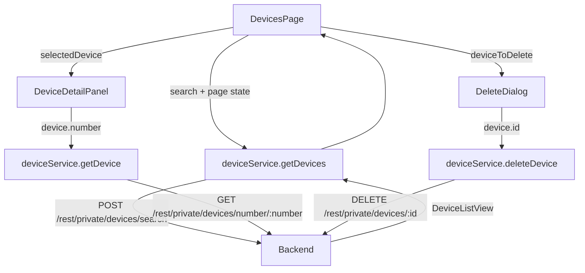

# Design Document: Devices Management

## Overview

The Devices Management feature adds a fully functional `/devices` page to the HMDM frontend. It replaces the current placeholder with a paginated, searchable table of enrolled devices, a slide-in detail panel, color-coded status badges, and a delete confirmation dialog.

All data flows through a dedicated `deviceService` module that wraps the existing `apiClient`. The UI is built exclusively from shadcn/ui components following the same patterns established by the existing navigation shell and auth pages.

### Key Backend API Findings

From inspecting the backend source:

- **List endpoint**: `POST /rest/private/devices/search` with a `DeviceSearchRequest` JSON body (not a GET with query params). Pagination is **1-based** (`pageNum`, `pageSize`). Search filter is the `value` field.
- **Response shape**: `DeviceListView` → `{ devices: { items: DeviceView[], totalItemsCount: number }, configurations: Record<string, ConfigurationView> }`. The `configurations` map provides config names keyed by config ID.
- **statusCode**: A **string** — `"green"` (online), `"red"` (offline), `"yellow"` / `"brown"` / `"grey"` (various unknown/warning states).
- **Get single device**: `GET /rest/private/devices/number/{number}` — lookup is by device **number** (string), not numeric ID.
- **Delete**: `DELETE /rest/private/devices/{id}` — uses numeric ID.
- **Update**: `PUT /rest/private/devices` with full Device body.
- **Device groups**: `device.groups` is a `LookupItem[]` (array of `{ id, name }`), not a single `groupId`.

---

## Architecture

The feature follows the existing feature-slice pattern:

```
src/features/devices/
  DevicesPage.tsx        # Page component, route /devices
  deviceService.ts       # API calls via apiClient
  types.ts               # TypeScript interfaces

src/shared/ui/           # New shadcn/ui components to scaffold
  alert-dialog.tsx
  table.tsx
  skeleton.tsx
  pagination.tsx
  badge.tsx
  dropdown-menu.tsx

src/shared/hooks/
  useDebounce.ts         # 300ms debounce hook
```

### Data Flow



---

## Components and Interfaces

### DevicesPage

Top-level page component rendered at `/devices`. Owns all state:

| State | Type | Purpose |
|---|---|---|
| `devices` | `DeviceView[]` | Current page of devices |
| `configurations` | `Record<string, ConfigurationView>` | Config lookup from API |
| `total` | `number` | Total device count |
| `page` | `number` | Current page (1-based, mirrors backend) |
| `pageSize` | `number` | Items per page (default 20) |
| `search` | `string` | Raw search input value |
| `debouncedSearch` | `string` | Debounced value (300ms) |
| `loading` | `boolean` | List fetch in flight |
| `error` | `string \| null` | List fetch error |
| `selectedDevice` | `DeviceView \| null` | Device whose detail panel is open |
| `deviceToDelete` | `DeviceView \| null` | Device pending deletion |

The page re-fetches whenever `debouncedSearch` or `page` changes. When `debouncedSearch` changes, `page` resets to 1.

### DeviceDetailPanel

Renders inside a `Sheet` (side="right"). Receives `deviceNumber: string | null` and `onClose`. Manages its own `detail`, `detailLoading`, `detailError` state. Calls `deviceService.getDevice(number)` when `deviceNumber` changes.

### StatusBadge

Inline component. Maps `statusCode: string` to a `Badge` variant and label:

| statusCode | variant | label |
|---|---|---|
| `"green"` | `default` (green) | Online |
| `"red"` | `destructive` | Offline |
| anything else | `secondary` | Unknown |

### DeleteDialog

Wraps `AlertDialog`. Receives `device: DeviceView | null`, `onConfirm`, `onCancel`. Manages `deleting` and `deleteError` state internally.

### RowActionsMenu

`DropdownMenu` with two items: "View Details" and "Delete". Rendered in the last column of each table row.

---

## Data Models

### Frontend Types (`src/features/devices/types.ts`)

```typescript
// Mirrors DeviceView from backend
export interface DeviceView {
  id: number
  number: string
  description: string | null
  configurationId: number | null
  configName: string | null        // denormalized from configuration
  groups: LookupItem[]
  statusCode: string | null        // "green" | "red" | "yellow" | "brown" | "grey"
  lastUpdate: number | null        // Unix ms
  info: DeviceInfoView | null
  androidVersion: string | null
  serial: string | null
  imei: string | null
  phone: string | null
}

export interface DeviceInfoView {
  batteryLevel: number | null
  model: string | null
  imei: string | null
  phone: string | null
  androidVersion: string | null
}

export interface LookupItem {
  id: number
  name: string
}

export interface ConfigurationView {
  id: number
  name: string
}

// POST body for /rest/private/devices/search
export interface DeviceSearchRequest {
  pageNum: number    // 1-based
  pageSize: number
  value?: string     // search filter
}

// Mirrors DeviceListView from backend
export interface DeviceListResponse {
  devices: {
    items: DeviceView[]
    totalItemsCount: number
  }
  configurations: Record<string, ConfigurationView>
}
```

### API Response Wrapping

The backend wraps all responses in `{ status: "OK" | "ERROR", data: T }`. The `apiClient` response interceptor does not unwrap this — callers must access `response.data.data` (axios data → backend data field). The `deviceService` will unwrap to return the inner payload directly.

---

## Correctness Properties

*A property is a characteristic or behavior that should hold true across all valid executions of a system — essentially, a formal statement about what the system should do. Properties serve as the bridge between human-readable specifications and machine-verifiable correctness guarantees.*

### Property 1: Status badge mapping is total and correct

*For any* `statusCode` string value, `StatusBadge` must render exactly one of: a badge labeled "Online" (for `"green"`), a badge labeled "Offline" (for `"red"`), or a badge labeled "Unknown" (for all other values). No statusCode value should produce an unlabeled or missing badge.

**Validates: Requirements 5.1, 5.4**

### Property 2: Every device row contains a status badge

*For any* non-empty list of devices returned by the API, every row rendered in the table must contain a `StatusBadge` component.

**Validates: Requirements 5.2**

### Property 3: Search resets page to 1

*For any* current page state and any new search term (including empty string), applying the search must reset the page number to 1 before issuing the API call.

**Validates: Requirements 2.3, 2.4, 3.4**

### Property 4: Debounce collapses rapid inputs into one call

*For any* sequence of search input changes occurring within 300ms of each other, the API must be called at most once after the debounce period expires — not once per keystroke.

**Validates: Requirements 2.2**

### Property 5: Pagination controls appear iff total exceeds page size

*For any* API response, pagination controls are rendered if and only if `totalItemsCount > pageSize`. The rendered text must include the current page number and the total device count.

**Validates: Requirements 3.1, 3.5**

### Property 6: Page navigation calls service with correct page number

*For any* page number N clicked in the pagination controls, `deviceService.getDevices` must be called with `pageNum: N`.

**Validates: Requirements 3.2**

### Property 7: Detail panel fetches by device number

*For any* device row clicked, `deviceService.getDevice` must be called with that device's `number` field (not its numeric `id`).

**Validates: Requirements 4.2**

### Property 8: Detail panel renders all required fields

*For any* device detail response, the rendered `DeviceDetailPanel` must display: device name/number, status badge, configuration name, group names, battery level (or "N/A"), last update timestamp (formatted), and GPS coordinates or "Location unavailable".

**Validates: Requirements 4.4**

### Property 9: Delete confirmation calls service with correct ID

*For any* device, when the user confirms deletion, `deviceService.deleteDevice` must be called with that device's numeric `id`.

**Validates: Requirements 6.2**

### Property 10: Cancel delete makes no API call

*For any* device with the delete dialog open, clicking Cancel must not trigger any call to `deviceService.deleteDevice`.

**Validates: Requirements 6.6**

### Property 11: Service error propagation

*For any* `deviceService` function, when the underlying `apiClient` call rejects (non-2xx response), the service function must re-throw the error rather than swallowing it.

**Validates: Requirements 7.6**

### Property 12: Null-safe field access

*For any* `DeviceView` object where optional fields (`info`, `lastUpdate`, `groups`, `configurationId`) are absent or null, rendering the device row and detail panel must not throw a runtime error.

**Validates: Requirements 8.5**

---

## Error Handling

| Scenario | Behavior |
|---|---|
| List fetch fails | Show error banner with message and "Retry" button; table hidden |
| Detail fetch fails | Show error message inside the Sheet; skeleton replaced |
| Delete fails | Show error inside AlertDialog; dialog stays open; confirm button re-enabled |
| 401 on any call | `apiClient` interceptor clears token and redirects to `/login` |
| Empty list | Show empty-state illustration and "No devices enrolled" message |
| Empty search results | Show "No devices found for '{search}'" message |

All error messages use the error's `message` field if available, falling back to a generic string.

---

## Testing Strategy

### Dual Testing Approach

Both unit tests and property-based tests are required. They are complementary:
- Unit tests cover specific examples, integration points, and error states
- Property tests verify universal correctness across randomized inputs

### Unit Tests (Vitest + React Testing Library)

Focus areas:
- `StatusBadge` renders correct label and variant for `"green"`, `"red"`, and an unknown code
- `DevicesPage` shows skeleton while loading, error state on failure, empty state on empty list
- `DevicesPage` shows "no devices found" with search term when search returns empty
- `DeleteDialog` disables confirm button while deleting, shows error on failure, closes on success
- `DeviceDetailPanel` shows skeleton while loading, error on failure, "Location unavailable" when GPS absent
- `deviceService.getDevices` constructs the correct POST body from `DeviceSearchRequest`
- `deviceService` error propagation: mock a 500 response and assert the promise rejects

### Property-Based Tests (fast-check)

Each property test runs a minimum of 100 iterations. Each test is tagged with a comment referencing the design property.

```
// Feature: devices-management, Property 1: Status badge mapping is total and correct
// Feature: devices-management, Property 3: Search resets page to 1
// Feature: devices-management, Property 4: Debounce collapses rapid inputs into one call
// Feature: devices-management, Property 5: Pagination controls appear iff total exceeds page size
// Feature: devices-management, Property 6: Page navigation calls service with correct page number
// Feature: devices-management, Property 7: Detail panel fetches by device number
// Feature: devices-management, Property 8: Detail panel renders all required fields
// Feature: devices-management, Property 9: Delete confirmation calls service with correct ID
// Feature: devices-management, Property 10: Cancel delete makes no API call
// Feature: devices-management, Property 11: Service error propagation
// Feature: devices-management, Property 12: Null-safe field access
```

**Generators needed**:
- `fc.record({ statusCode: fc.oneof(fc.constant("green"), fc.constant("red"), fc.string()) })` for Property 1
- `fc.array(arbitraryDeviceView(), { minLength: 1 })` for Property 2
- `fc.tuple(fc.integer({ min: 1 }), fc.string())` (page, searchTerm) for Property 3
- `fc.array(fc.string(), { minLength: 2 })` (rapid keystrokes) for Property 4
- `fc.record({ totalItemsCount: fc.integer({ min: 0 }), pageSize: fc.integer({ min: 1 }) })` for Property 5
- `arbitraryDeviceView()` with nullable fields for Property 12

### shadcn/ui Components to Scaffold

The following components must be added to `src/shared/ui/` before implementation:

| Component | Source |
|---|---|
| `badge.tsx` | `npx shadcn@latest add badge` |
| `table.tsx` | `npx shadcn@latest add table` |
| `skeleton.tsx` | `npx shadcn@latest add skeleton` |
| `pagination.tsx` | `npx shadcn@latest add pagination` |
| `alert-dialog.tsx` | `npx shadcn@latest add alert-dialog` |
| `dropdown-menu.tsx` | `npx shadcn@latest add dropdown-menu` |
