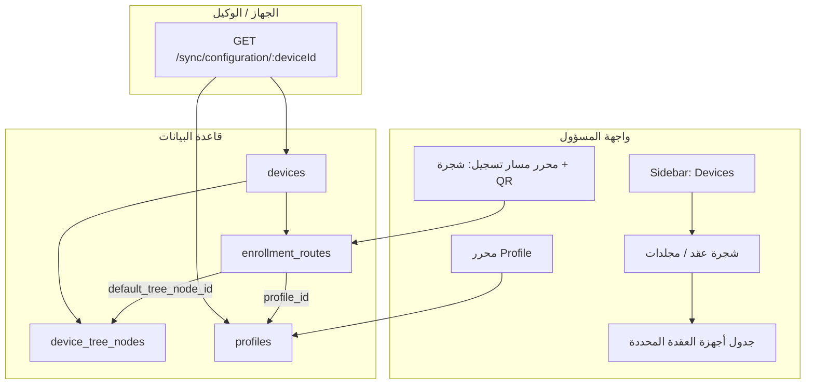
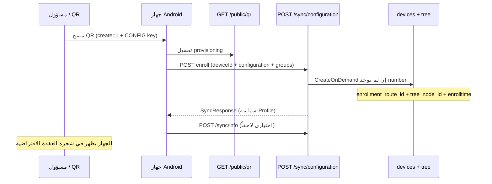

# Blueprint: Device Control Plane (شجرة · Profile · Enrollment Route)

**نوع الوثيقة:** معمارية منصة (blueprint) — ليست feature spec لمهمة واحدة.  
**التاريخ:** 2026-05-23 (محدّث: نطاق سيرفر+ويب فقط §0، بوابات §20)  
**الفرع المرجعي:** `main`

> **التحول الذهني:** من «MDM يخزن settings» إلى **نظام يُنسّق دورة حياة الجهاز كاملة** (orchestration).  
> **قراران أنقذا المشروع مبكراً:** (1) **Enrollment Route ≠ Profile** (2) **الشجرة first-class placement layer** — ليس filter تجميلي.

| اقرأ أولاً | القسم |
|------------|--------|
| الفصل الأساسي | [§17.15](#1715-القرار-المعماري-الأهم-مؤكد) |
| Blueprint إضافي | [§18](#18-blueprint--طبقات-ناقصة-ومسار-تنفيذ) |
| Enroll تلقائي | [§3.5](#35-إضافة-الأجهزة-تلقائياً-عند-مسح-qr-وإكمال-enrollment-إلزامي) |
| Compile pipeline | [§18.6](#186-fصل-نموذج-المحرر-عن-artifact-المزامنة--p0-تصميم) |
| بوابات Go/No-Go + تقارير | [§20](#20-بوابات-الانتقال-go-no-go-وتقارير-قبل-كل-مرحلة) |
| **نطاق التنفيذ الحالي** | **[§0](#0-نطاق-التنفيذ-الحالي--سيرفر-وويب-فقط)** |

> **تسمية:** في الوثيقة التقنية قد يظهر `policies` كاسم جدول؛ في **واجهة المستخدم** المقترح **مسار التسجيل** وليس «Policy» — انظر [§14.2](#142-التسمية--تجنب-policy-في-واجهة-mdm).

---

## 0. نطاق التنفيذ الحالي — سيرفر وويب فقط

> **قرار تنفيذي (المرحلة الحالية):** كل العمل المخطَّط للتنفيذ **الآن** يقتصر على **`serverBackendGo`** و **`frontend`** (لوحة المسؤول). **لا تعديلات على تطبيق الهاتف** (Headwind launcher / MDM agent) في هذه المرحلة.

### 0.1 داخل النطاق (In scope)

| الطبقة | مسارات / وحدات |
|--------|----------------|
| **سيرفر** | `serverBackendGo/internal/modules/*` — configurations → profiles/routes، devices، sync، qrcode، push، migrations |
| **ويب** | `frontend/src/features/*` — devices، configurations، layout، enrollment QR UI |
| **قاعدة بيانات** | `serverBackendGo/db/migrations/` |
| **توثيق / specs** | `specs/017-*`, بوابات §20 |

### 0.2 خارج النطاق (Out of scope — مؤجّل)

| البند | السبب | متى |
|-------|--------|-----|
| تعديل كود Android / launcher | تسريع التسليم؛ الاعتماد على Headwind الحالي | مرحلة لاحقة عند حاجة `useId=random` أو delta sync |
| `useId=random` جديد في provisioning | يتطلب وكيلاً يفهمه | مؤجل |
| استهلاك `profileRevision` على الجهاز | تحسين اختياري | مؤجل |
| delta sync / أوامر rollout على الوكيل | منصة متقدمة | Sprint 6+ أو منتج منفصل |

### 0.3 توافق الوكيل بدون تطويره

الوكيل يُعامل كـ **عقد ثابت (black box)**. السيرفر والويب يلتزمان بما يدعمه Headwind **اليوم**:

| قدرة | التنفيذ (سيرفر/ويب فقط) |
|------|-------------------------|
| إنشاء جهاز عند enroll | `POST /rest/public/sync/configuration/:deviceId` + `CreateOnDemand` |
| QR تسجيل | `create=1` + `com.hmdm.CONFIG` في provisioning — **إلزامي** من اللوحة |
| معرّف الجهاز | **`imei` أو `serial` أو `request`** في QR (§3.6) — **لا** `random` مخصص حتى تحديث الوكيل |
| QR لجهاز معروف | `deviceId` في استعلام QR (سيرفر يضع `com.hmdm.DEVICE_ID`) |
| سياسة الجهاز | `SyncResponse` بنفس الشكل؛ `configurationId` يبقى |
| حقول جديدة للوكيل | `profileRevision` يُضاف للـ JSON — **الوكيل يتجاهلها** بأمان |

**اختبار الوكيل:** جهاز حقيقي أو محاكي **للتحقق (QA)** فقط — ليس لتطوير تطبيق.

### 0.4 تعديلات على الـ blueprint بسبب هذا النطاق

| قسم | تعديل المرحلة الحالية |
|-----|------------------------|
| §3.5 `create=1` | تفعيل من **الويب** دائماً — لا checkbox اختياري |
| §3.6 معرّف عشوائي | **مؤجل**؛ بديل حالي: `imei` / `serial` / `request` أو `deviceId` من اللوحة |
| §17.6 `profileRevision` | **يُضاف في السيرفر**؛ لا يُشترط سلوك على الجهاز |
| §18.8 capabilities | P2 — لا تنفيذ الآن |
| §18.5 enrollment_sessions | سيرفر يسجّل من POST enroll — بدون hooks من التطبيق |

### 0.5 معايير قبول نطاق المرحلة

- [ ] لا commits في repo تطبيق Android (إن وُجد منفصل — لا تغيير مطلوب).
- [ ] كل feature جديد له API Go + UI React (أو migration).
- [ ] enroll E2E يمر بـ **وكيل Headwind الحالي** دون fork.
- [ ] أي حاجة تتطلب تطبيق هاتف → تُسجَّل في backlog «Agent phase» ولا تُحجب Sprint الحالي.

### 0.6 Sprints الحالية (ملخص)

| Sprint | سيرفر | ويب | وكيل |
|--------|-------|-----|------|
| 1 — شجرة + enroll | ✅ | ✅ | تحقق QA فقط |
| 2 — profile versions + compile | ✅ | ✅ | تحقق parity sync |
| 3 — enrollment routes + artifact sync | ✅ | ✅ | تحقق QA |
| 4–6 | ✅ | ✅ | تحقق عند اللزوم |

---

## 1. ملخص الرؤية

| المفهوم الحالي | المفهوم المستهدف | الدور |
|----------------|------------------|--------|
| **Configurations** (تكوين) | **Enrollment route** (مسار التسجيل) | توجيه الجهاز إلى **عقدة في الشجرة** + **QR** + ربط Profile |
| محتوى التبويبات (قيود، MDM، تطبيقات، تصميم، ملفات…) | **Profile** (ملف جهاز) | **كل إعدادات الجهاز والقيود** عند المزامنة |
| **Groups** (مجموعات مسطحة) + قائمة أجهزة | **شجرة أجهزة** في السايدبار | تنظيم هرمي عند تبويب **Devices** |
| `devices.configurationid` | `enrollment_route_id` + `tree_node_id` | ربط الجهاز بمسار التسجيل وموضع الشجرة |



---

## 2. الوضع الحالي (As-Is)

### 2.1 قاعدة البيانات

| الجدول | الغرض | هيكل هرمي؟ |
|--------|--------|-------------|
| `configurations` | سياسة + QR + `settingsjson` + أعمدة UI/MDM | لا |
| `configurationapplications` | تطبيقات مرتبطة بالتكوين | — |
| `configurationfiles` | ملفات التكوين | — |
| `configurationapplicationsettings` | إعدادات تطبيق على مستوى التكوين | — |
| `configurationapplicationparameters` | `skipVersionCheck` | — |
| `devices` | `configurationid` NOT NULL → تكوين واحد | لا |
| `groups` | اسم + `customerid` | **مسطح** (لا `parent_id`) |
| `devicegroups` | M:N جهاز ↔ مجموعة | — |

**ملفات الهجرة الرئيسية:**  
`serverBackendGo/db/migrations/000001_init.up.sql`, `000006_devices_groups_core.up.sql`, `000007_applications_configurations_core.up.sql`, `000017_configurations_legacy_import.up.sql`, `000018_configurations_qrcodekey_backfill.up.sql`

**حقول حرجة في `configurations` اليوم:**

- أعمدة SQL: `name`, `description`, `type`, `password`, ألوان/صورة، `qrcodekey`, `baseurl`, `mainappid`, `contentappid`, `permissive`, `defaultfilepath`
- **`settingsjson` (JSONB):** GPS، Bluetooth، kiosk، `restrictions`, `policyLocks`, جداول زمنية، Wi‑Fi provisioning، إلخ.
- جداول فرعية: تطبيقات، ملفات، إعدادات تطبيق

### 2.2 الباك‌اند (Go)

| الوحدة | المسار | API أساسي |
|--------|--------|-----------|
| Configurations | `internal/modules/configurations/` | `/rest/private/configurations/*` |
| Devices | `internal/modules/devices/` | `/rest/private/devices/*` |
| Groups | `internal/modules/groups/` | `/rest/private/groups/*` |
| Sync (وكيل) | `internal/modules/sync/` | `/rest/public/sync/configuration/:deviceId` |
| Push | `internal/platform/push/` | إشعار `configUpdated` بعد حفظ التكوين |

**مسار المزامنة للجهاز:**

1. الجهاز مرتبط بـ `devices.configurationid`
2. `BuildSyncResponse` يقرأ صف `configurations` + joins للتطبيقات/الملفات
3. `sync_configuration_mapper.go` يدمج `settingsjson` → `SyncResponse`
4. حفظ التكوين → `NotifyConfigurationChanged` → أجهزة بنفس `configurationid` تعيد السحب

**لا يوجد** في الكود الحالي: `parent_id` لمجلدات، `tree_node`, أو API شجرة.

### 2.3 الفرونت‌اند (React)

| المسار | المكوّن | المحتوى |
|--------|---------|---------|
| `/configurations` | `ConfigurationsPage.tsx` | قائمة + QR + عدد أجهزة |
| `/configurations/:id/edit` | `ConfigurationEditorPage.tsx` | 7 تبويبات محلية |
| `/devices` | `DevicesPage.tsx` | جدول + فلاتر + إجراءات جماعية (بدون شجرة) |

**تبويبات محرر التكوين الحالية:**

| التبويب | الملف | ما يُفترض نقله إلى Profile |
|---------|------|------------------------------|
| Common | `ConfigurationCommonTab.tsx` | الاسم/الوصف يبقى على Policy؛ الباقي (push، GPS، kiosk toggle…) → Profile |
| MDM | `ConfigurationMdmTab.tsx` | تطبيقات رئيسية/محتوى، receiver، kiosk، Wi‑Fi QR params → **تقسيم:** QR/main app على Policy؛ الباقي Profile |
| Restrictions | `ConfigurationRestrictionsTab.tsx` | **كامل → Profile** |
| Design | `ConfigurationDesignTab.tsx` | **كامل → Profile** |
| Applications | `ConfigurationApplicationsTab.tsx` | **كامل → Profile** |
| App Settings | `ConfigurationAppSettingsTab.tsx` | **كامل → Profile** |
| Files | `ConfigurationFilesTab.tsx` | **كامل → Profile** |

**السايدبار:** `navItems.ts` — عنصر واحد `Devices → /devices` بدون أبناء.  
**المجموعات:** صفحة منفصلة `/groups` وليست تحت الأجهزة.

### 2.4 QR والتسجيل

- مفتاح: `configurations.qrcodekey`
- أهلية QR (فرونت): `configurationQr.ts` — `mainAppId`, `eventReceivingComponent`, `qrCodeKey`
- عام: `GET/POST /rest/public/qr/{key}`, `POST /rest/public/sync/configuration/:deviceId` (إنشاء الجهاز عند أول تسجيل)
- **إنشاء الجهاز في DB:** `device_sync_repo.CreateOnDemand` عند **POST** enroll إذا لم يكن `number` موجوداً — يحل التكوين من `qrcodekey` ويضع `configurationid` + مجموعات اختيارية

**فجوة اليوم (مهمة للمنتج):**

| السلوك | الواقع الحالي |
|--------|----------------|
| إضافة الجهاز للقائمة تلقائياً | **اختياري** — يعتمد على `create=1` في QR (صندوق «Add to device list» في `EnrollmentQrExperience`، **افتراضي: مغلق**) |
| بدون `create=1` | الوكيل قد يكمل التثبيت محلياً دون صف في `devices` → المسؤول لا يرى الجهاز في الشجرة/الجدول |
| GET sync | **لا** ينشئ جهازاً — فقط POST enroll |
| موضع الشجرة | **غير موجود** — لا `tree_node_id` |

---

## 3. الوضع المستهدف (To-Be)

### 3.1 Enrollment Route (بدلاً من Configuration — انظر §14.2 للتسمية)

> **في الكود والـ DB** يمكن الإبقاء على اسم الجدول `policies` مؤقتاً؛ **في واجهة المستخدم** يُفضّل عدم عرض كلمة «Policy» وحدها (انظر القسم 14).

**المسؤولية الوحيدة في واجهة المسؤول:**

1. **توجيه مسار الجهاز في الشجرة** — عقدة افتراضية (وممكن عقد بديلة لقواعد مستقبلية)
2. **QR** — `qrcodekey`, ربط `mainAppId` للتسجيل؛ **كل QR صادر من مسار تسجيل يفرض `create=1`** (انظر §3.5)
3. **ربط إصدار بروفايل** — `profile_version_id` (انظر §17.2؛ مؤقتاً `profile_id` أثناء الهجرة)
4. **بيانات تعريفية** — `name`, `description`, `type` (WORK/COMMON) إن لزم للتمييز الإداري

**ما يُزال من محرر مسار التسجيل:** تبويبات القيود، التصميم، التطبيقات، الملفات، ومعظم MDM.

### 3.2 Profile (جديد) — هوية قابلة لإعادة الاستخدام + إصدارات

**يضم كل ما يذهب للجهاز عند المزامنة** (ما عدا اختيار عقدة الشجرة).  
**لا يُعدَّل المحتوى المنشور مباشرة** — انظر **Draft → Publish → ProfileVersion** في [§17.2](#172-profile-versioning--p0).

| مصدر حالي | حقل/جدول مقترح |
|-----------|----------------|
| `settingsjson` + apps/files | **`profile_versions`** (انظر §17.2) |
| `profiles` | كيان منطقي فقط: `id`, `name`, `description`, `customerid` |
| `policyLocks` | داخل `settingsjson` للإصدار المنشور |

**واجهة:** `/profiles` + محرر يعمل على **draft**؛ زر **Publish** ينشئ إصداراً جديداً.

### 3.3 شجرة الأجهزة (Device Tree)

**الموضع في UX (حسب الطلب):**

- عند الضغط على **Devices** في السايدبار: توسيع لوحة ثانوية (أو split view) تعرض **شجرة عقد**
- المحتوى الرئيسي: أجهزة العقدة المحددة (جدول مع فلاتر فرعية)
- الشجرة **ليست** صفحة Groups الحالية — Groups قد تبقى tags أو تُدمج لاحقاً

**نموذج بيانات مقترح:**

```sql
CREATE TABLE device_tree_nodes (
    id          SERIAL PRIMARY KEY,
    customerid  INT NOT NULL REFERENCES customers(id) ON DELETE CASCADE,
    parent_id   INT REFERENCES device_tree_nodes(id) ON DELETE CASCADE,
    name        VARCHAR(200) NOT NULL,
    sort_order  INT NOT NULL DEFAULT 0,
    -- P0: تجنّب recursive CTE الثقيلة (§17.3)
    path        TEXT NOT NULL,   -- مثال: '/1/4/9/'
    depth       INT NOT NULL DEFAULT 0,
    created_at  TIMESTAMPTZ NOT NULL DEFAULT now()
);

-- بديل PostgreSQL: عمود ltree + GIST index (§17.3)
CREATE INDEX device_tree_nodes_parent_idx ON device_tree_nodes(parent_id);
CREATE INDEX device_tree_nodes_path_idx ON device_tree_nodes(customerid, path);
CREATE UNIQUE INDEX device_tree_nodes_name_parent_uidx
    ON device_tree_nodes(customerid, parent_id, lower(name));
```

```sql
ALTER TABLE devices ADD COLUMN tree_node_id INT REFERENCES device_tree_nodes(id);
-- policies: عقدة افتراضية للأجهزة المسجّلة عبر QR هذا البوليسي
ALTER TABLE enrollment_routes ADD COLUMN default_tree_node_id INT REFERENCES device_tree_nodes(id);
ALTER TABLE enrollment_routes ADD COLUMN profile_version_id INT REFERENCES profile_versions(id);
-- أمان مستقبلي (§17.8): expires_at, max_enrollments, revoked_at
```

**سلوك:**

- تسجيل عبر QR → جهاز جديد تحت `enrollment_routes.default_tree_node_id` **تلقائياً** عند اكتمال enroll (§3.5)
- سحب/نقل في الشجرة → تحديث `devices.tree_node_id`
- حذف عقدة: سياسة CASCADE أو نقل الأبناء/الأجهزة (قرار منتج)

### 3.5 إضافة الأجهزة تلقائياً عند مسح QR وإكمال Enrollment (متطلب إلزامي)

> **قرار منتج:** لا يُنشأ مسار تسجيل (Enrollment route) لأجل QR «عرض فقط». أي جهاز يُكمِل التسجيل بنجاح **يجب** أن يظهر في قائمة الأجهزة وفي الشجرة دون إدخال يدوي من المسؤول.

#### متى يُعتبر «اكتمل التسجيل»؟



| المرحلة | API | نتيجة DB |
|---------|-----|----------|
| 1 — أول اتصال ناجح | `POST /rest/public/sync/configuration/:deviceId` + body (`configuration` = `qrcodekey`, `groups`…) | `INSERT INTO devices` عبر `CreateOnDemand` |
| 2 — تأكيد حيوية | `POST /rest/public/sync/info` | تحديث `info` / `lastupdate` (الجهاز موجود مسبقاً) |
| 3 — مزامنات لاحقة | `GET /rest/public/sync/configuration/:deviceId` | لا إنشاء جديد؛ تحديث `lastupdate` |

**لا يعتمد الإنشاء على:** فتح المسؤول لصفحة Devices أو حفظ `DeviceForm` يدوياً.

#### سلوك مستهدف (To-Be)

| # | قاعدة |
|---|--------|
| 1 | كل QR لمسار تسجيل يُولَّد بـ **`create=1` دائماً** في `provisioning` (`com.hmdm.CONFIG` + `BASE_URL`) |
| 2 | `CreateOnDemand` يضبط **`enrollment_route_id`** (أو `configurationid` أثناء الانتقال) من `qrcodekey` |
| 3 | يضبط **`tree_node_id`** = `enrollment_routes.default_tree_node_id` (إلزامي؛ إن فارغ → جذر العميل `All devices`) |
| 4 | يضبط **`enrolltime`** = وقت أول POST enroll ناجح |
| 5 | مجموعات QR الافتراضية (إن وُجدت على المسار) تُطبَّق على `devicegroups` كما اليوم |
| 6 | الواجهة: بعد enroll، الجهاز **يظهر فوراً** في جدول عقدة الشجرة (refresh أو WebSocket لاحقاً؛ كحد أدنى عند إعادة فتح الصفحة) |

#### تغييرات مقترحة على الكود الحالي (قبل/أثناء الهجرة)

| طبقة | اليوم | مطلوب |
|------|--------|--------|
| `EnrollmentQrExperience.tsx` | `createOnDemand` افتراضي `false` + checkbox | لـ QR مسار التسجيل: **`create=true` ثابت**؛ إخفاء الـ checkbox أو جعله للوضع المتقدم فقط |
| `enrollmentQrQuery.ts` | يضيف `create=1` عند `create: true` | مسارات التسجيل الرسمية **دائماً** `create: true` |
| `provisioning.go` | يضع `com.hmdm.CONFIG` عند `create=1` | لا تغيير منطقي — التأكد أن QR الإداري لا يُصدَر بدون `create` |
| `device_sync_repo.CreateOnDemand` | `configurationid` + groups | + `tree_node_id`؛ `enrolltime`؛ **معرّف عشوائي** إن لم يُمرَّر (§3.6) |
| `DeviceForm` / إنشاء يدوي | مسار منفصل | يبقى للأجهزة اليدوية؛ QR **بدون** رقم مسبق |
| `DeviceForm` edit | `number` readOnly | تفعيل تعديل الاسم + معرّف متقدم مع `oldnumber` (§3.6) |

#### حالات حافة

| الحالة | السلوك |
|--------|--------|
| `PreventDuplicateEnrollment` مفعّل والجهاز موجود | `POST enroll` → خطأ `device exists` — لا جهاز مكرر (كما اليوم) |
| جهاز موجود بنفس `number` بتكوين آخر | قرار منتج: رفض أو نقل لمسار QR الحالي — **يُوثَّق في spec** |
| فشل POST enroll بعد مسح QR | لا صف في DB؛ المسؤول يرى «لم يُسجَّل» في سجلات الوكيل فقط |
| multi-tenant (`customer` في body) | إلزامي عند أكثر من عميل — كما `resolveCustomerID` اليوم |

#### معايير قبول

- [ ] مسح QR من مسار تسجيل صالح + إكمال إعداد Android → خلال 60 ثانية يظهر الجهاز تحت **عقدة الشجرة الافتراضية** للمسار في `/devices`.
- [ ] لا خطوة «أضف الجهاز للقائمة» للمسؤول في المسار السعيد.
- [ ] `enrolltime` و `configurationid` / `enrollment_route_id` مضبوطان في أول POST ناجح.
- [ ] QR المطبوع من لوحة التحكم يحتوي دائماً `create=1` (اختبار تكامل على `/public/qr/json/{key}`).

### 3.6 معرّف/اسم الجهاز عشوائي عند التسجيل — وتعديله لاحقاً

> **قرار منتج:** عند التسجيل عبر QR (مسار تسجيل عام، بدون رقم مُدخل مسبقاً من المسؤول)، يحصل الجهاز على **معرّف عشوائي فريد** يظهر في القائمة؛ يمكن للمسؤول **تغيير الاسم الظاهر** (ولمعرّف الوكيل عند الحاجة) لاحقاً من واجهة الأجهزة.

#### تمييز الحقول في Headwind / Go

| الحقل DB | الدور | عند QR تلقائي | تعديل لاحق |
|----------|--------|----------------|-------------|
| `devices.agent_id` | **هوية داخلية ثابتة** (UUID) — audit/events/FK | يُولَّد عند INSERT | **لا يتغير** ([§18.2](#182-device-identity-layer--p0-تصميم)) |
| `devices.number` | معرّف sync (`/sync/configuration/:deviceId`) | **يُولَّد عشوائياً** | mutable + `oldnumber` |
| `devices.description` | اسم ظاهر للمسؤول | من المعرّف أو «جهاز جديد» | **حر** |

في واجهة المسؤول يُفضّل عرض **الاسم** (`description`) في الجدول والشجرة، مع إظهار `number` كـ «معرّف تقني» ثانوي أو عمود اختياري.

#### الوضع الحالي

| السلوك | الواقع |
|--------|--------|
| QR بدون `deviceId` | `useId=request` — الوكيل يطلب/يحدد المعرّف (سلوك Android)؛ **ليس** توليداً عشوائياً موحّداً من الخادم |
| QR مع `deviceId` في الحقل | مسؤول يحدد رقماً ثابتاً — مناسب لجهاز معروف، **ليس** المسار الافتراضي |
| تعديل الاسم | `description` قابل للتعديل في `DeviceForm` |
| تعديل `number` | الحقل **readOnly** في وضع التعديل (`DeviceForm.tsx`)؛ الـ API يحدّث `number` لكن **لا يضبط `oldnumber`** → خطر كسر مزامنة الوكيل |

#### السلوك المستهدف

**1) عند إصدار QR لمسار تسجيل (افتراضي) — [§0 سيرفر+ويب فقط]:**

- **لا** يُطلب من المسؤول إدخال رقم جهاز في `EnrollmentQrExperience` (للـ QR العام).
- QR يُبنى **بدون** `deviceId`، مع **`useId=imei` أو `serial` أو `request`** (مدعوم من Headwind اليوم) — **ليس** `useId=random` (مؤجل — يحتاج تطبيق هاتف).
- **معرّف عشوائي صريح (`DEV-xxxx`):** مؤجل لمرحلة الوكيل؛ أو يُستخدم QR **per-device** من صف الجهاز (`deviceId` في الاستعلام — سيرفر فقط).

**صيغة مقترحة للمعرّف العشوائي (خادم أو وكيل):**

```
DEV-{8 أحرف hex عشوائية}   مثال: DEV-a3f91c2b
```

- فريد ضمن `customerid` (فحص قبل INSERT + إعادة محاولة).
- محظور في الاسم: `/ ? &` (كما تحقق الفرونت اليوم).

**2) عند `CreateOnDemand`:**

```sql
INSERT INTO devices (number, description, ...)
VALUES ($randomNumber, $randomNumber, ...);  -- أو description = 'جهاز جديد'
```

**3) تعديل لاحق من المسؤول:**

| إجراء | UX | Backend |
|--------|-----|---------|
| تغيير **الاسم الظاهر** | حقل «اسم الجهاز» في التفاصيل/النموذج | `PUT /devices` → `description` فقط |
| تغيير **معرّف الوكيل** | قسم «متقدم» + تحذير: «سيُعاد تشغيل المزامنة على الجهاز» | عند تغيير `number`: `oldnumber = <القديم>` ثم `number = <الجديد>`؛ Sync يحلّ عبر `oldnumber` (موجود في `resolveDevice`) |
| إعادة تسمية جماعية | لاحقاً (P2) | — |

**4) واجهة الشجرة/الجدول:**

- جهاز جديد يظهر باسم المعرّف العشوائي أو «جهاز جديد» حتى يعدّله المسؤول.
- إجراء سريع: «تسمية» من صف الجهاز (inline edit على `description`).

#### تغييرات تقنية مقترحة

| طبقة | التعديل |
|------|---------|
| `enrollmentQrQuery.ts` | افتراضي `imei` أو `serial` لمسارات التسجيل (§0)؛ إخفاء حقل رقم الجهاز للـ QR العام |
| `provisioning.go` | **لا** `useId=random` في المرحلة الحالية |
| `CreateOnDemand` | إن وُجد توليد من الخادم: `generateDeviceNumber(customerID)` |
| `device_repo.Update` | إذا `number` تغيّر: `UPDATE ... oldnumber = $old, number = $new` |
| `DeviceForm.tsx` | السماح بتعديل `number` في edit مع تحذير؛ أو فصل «اسم» عن «معرّف» |
| `DevicesPage` / الشجرة | عمود «الاسم» = `description ?? number` |

#### معايير قبول

- [ ] مسح QR عام (بدون رقم مسبق) → جهاز جديد في DB والقائمة بمعرّف من **imei/serial/request** (§0) — عشوائي صريح مؤجل.
- [ ] لا يتطلب المسؤول اختيار رقم قبل الطباعة/المسح.
- [ ] تعديل `description` من واجهة الجهاز يظهر فوراً في الشجرة/الجدول.
- [ ] تغيير `number` (متقدم) يحفظ `oldnumber` والوكيل يتابع المزامنة بالمعرّف الجديد بعد إعادة المزامنة.

#### حالات حافة

| الحالة | السلوك |
|--------|--------|
| تصادم عشوائي (نادر) | إعادة توليد حتى 5 محاولات |
| مسؤول يُدخل `deviceId` يدوياً في QR متقدم | يُحترم المعرّف المُدخل (تسجيل جهاز معروف) |
| جهاز ميداني يُعيد التسمية محلياً قبل أول sync | يُعالج عبر `oldnumber` عند أول تطابق |

### 3.4 إعادة تسمية Configuration → Enrollment Route (مقترح منتج)

| الطبقة | إجراء مقترح |
|--------|-------------|
| DB | `policies` أو `enrollment_routes` (انظر §14.2) |
| API | `/rest/private/enrollment-routes` + alias `/configurations` |
| Permissions | `enrollment_routes` (أو الإبقاء على `configurations` داخلياً) |
| Frontend | مسارات `/enrollment-routes`؛ **لا تُعرض** كلمة Policy في العناوين |
| Agent sync | الإبقاء على `configurationId` في JSON للتوافق |

**توصية:** مرحلة انتقالية 2–3 إصدارات: API يقبل الاثنين؛ التسمية في UI أولوية قبل rename الجدول.

---

## 4. تأثير المزامنة (Sync) والوكيل

### 4.1 مسار السحب الحالي

```
GET /rest/public/sync/configuration/:deviceNumber
  → device.configurationid
  → configurations + configurationapplications + settingsjson
  → SyncResponse
```

### 4.2 مسار مقترح

```
GET /rest/public/sync/configuration/:deviceNumber
  → device.policyid
  → policies.profile_id
  → profiles + profileapplications + profile.settingsjson
  → SyncResponse (نفس الشكل الخارجي)
  → + profileRevision (§17.6) للجهاز والكاش
```

**ملفات Go للتعديل:**

| الملف | التغيير |
|-------|---------|
| `sync/adapter/persistence/postgres/device_sync_repo.go` | حل enrollment route بالـ QR؛ **`CreateOnDemand` + `tree_node_id` إلزامي** (§3.5) |
| `sync/application/sync_configuration_mapper.go` | مصدر البيانات = profile بدل configuration |
| `configurations/application/service.go` | يصبح `policies` (إشعار push حسب `policyid`) |
| **جديد** `profiles/application/service.go` | حفظ profile + `NotifyProfileChanged` → كل الأجهزة عبر `policies.profile_id` |

**Push:** عند حفظ Profile يجب إشعار كل الأجهزة المرتبطة بأي Policy يشير إلى هذا `profile_id`:

```sql
SELECT d.id FROM devices d
JOIN policies p ON p.id = d.policyid
WHERE p.profile_id = $1;
```

---

## 5. خطة الفرونت‌اند

### 5.1 السايدبار وتبويب الأجهزة

**الملفات:**

- `frontend/src/features/layout/navItems.ts` — `Devices` يصبح عنصراً بـ `children` أو `layout: 'devices-shell'`
- **جديد** `frontend/src/features/layout/DevicesSidebarTree.tsx`
- **جديد** `frontend/src/features/devices/DeviceTreePage.tsx` (layout: شجرة يسار + محتوى يمين)
- `frontend/src/app/App.tsx` — مسارات:
  - `/devices` → redirect أو جذر الشجرة
  - `/devices/tree/:nodeId` → قائمة أجهزة العقدة

**مكتبة UI:** `Tree` من shadcn أو `@headless-tree` — غير مستخدمة حالياً في المشروع.

### 5.2 Policy (محرر مبسّط)

| الملف الحالي | إجراء |
|--------------|--------|
| `ConfigurationsPage.tsx` | → `PoliciesPage.tsx` (أعمدة: اسم، بروفايل، عقدة شجرة، QR) |
| `ConfigurationEditorPage.tsx` | → `PolicyEditorPage.tsx` (تبويبان: General + QR/Enrollment + Tree path) |
| حذف/نقل التبويبات الثقيلة | إلى `ProfileEditorPage.tsx` |

### 5.3 Profile

| جديد | منسوخ من |
|------|----------|
| `features/profiles/ProfileEditorPage.tsx` | `ConfigurationEditorPage` + التبويبات الستة |
| `features/profiles/profileService.ts` | `configurationService` (مسارات `/private/profiles`) |
| `features/profiles/types.ts` | `configurations/types.ts` |

### 5.4 تحديث ربط الجهاز

| الملف | التغيير |
|-------|---------|
| `DeviceForm.tsx` | `policyId` + اختيار `treeNodeId` (أو من الشجرة فقط) |
| `DevicesPage.tsx` | فلترة حسب `treeNodeId`؛ bulk نقل عقدة |
| `FilterPanel.tsx` | فلتر policy + عقدة شجرة |
| `SettingsPage.tsx` | default policy للأجهزة الجديدة |
| `configurationQr.ts` | → `policyQr.ts` يقرأ من policy |

---

## 6. خطة الباك‌اند و API

### 6.1 وحدات جديدة / مقسمة

```
internal/modules/
  policies/          # كان configurations (مختصر)
  profiles/          # سياسة MDM الكاملة
  device_tree/       # CRUD شجرة + نقل عقد
  devices/           # policyid, tree_node_id
  sync/              # resolve profile via policy
```

### 6.2 Endpoints مقترحة

**Device tree** (`/rest/private/device-tree`)

| Method | Path | الوظيفة |
|--------|------|---------|
| GET | `/nodes` | شجرة كاملة للعميل (nested JSON) |
| PUT | `/nodes` | إنشاء/تحديث عقدة |
| DELETE | `/nodes/:id` | حذف (مع سياسة أبناء) |
| POST | `/nodes/:id/move` | تغيير `parent_id` / `sort_order` |
| POST | `/devices/move` | نقل أجهزة إلى عقدة |

**Profiles** (`/rest/private/profiles`)

| Method | Path |
|--------|------|
| GET | `/search`, `/:id` |
| PUT | `` (upsert) |
| DELETE | `/:id` |
| GET | `/applications/:id` | نفس نمط التكوين |

**Policies** (`/rest/private/policies`)

| Method | Path |
|--------|------|
| GET | `/search`, `/:id` |
| PUT | `` |
| DELETE | `/:id` |
| GET | `/qr-eligibility/:id` | اختياري |

**Alias مؤقت:** `Mount("/configurations", policiesHandler)` يعيد نفس الـ handler.

### 6.3 Devices API

- Body: `policyId` (بدل `configurationId`)
- بحث: `treeNodeId`, `policyId`, `descendantsOf` (كل أجهزة فرع شجرة — استعلام recursive CTE)

---

## 7. هجرة البيانات (Migration)

### المرحلة A — إضافة بدون كسر

1. إنشاء `profiles` (هوية) + **`profile_versions` v1** من كل `configurations`
2. إنشاء `enrollment_routes` من `configurations` مع **`profile_version_id`** = v1
3. `device_tree_nodes` + **`path`/`depth`** + جذر «All devices»
4. `devices`: `tree_node_id`, `enrollment_route_id`, **`profile_version_id`**, **`enrollment_state`**

### المرحلة B — تقسيم الأعمدة

5. محتوى السياسة على **`profile_versions` فقط** (draft/publish)
6. `enrollment_routes`: QR, placement, **`profile_version_id`** — binding فقط

### المرحلة C — إزالة التكرار

7. إسقاط أعمدة السياسة من `policies` بعد التأكد من Sync
8. Renaming permissions ومسارات الفرونت

### المرحلة D — Groups (اختياري)

- **خيار 1:** Groups تبقى وسوماً مستقلة عن الشجرة
- **خيار 2:** تحويل كل group إلى عقدة شجرة (هجرة واحدة)
- **خيار 3:** إخفاء Groups من UI والاعتماد على الشجرة فقط

---

## 8. مصفوفة:nقل التبويبات (Configuration → Profile / Policy)

| محتوى | الوجهة |
|-------|--------|
| Name, description, type | **Policy** |
| QR key, QR params, default groups on enroll | **Policy** |
| Main app (لأهلية QR) | **Policy** (أو Profile إن رُبط التسجيل بالبروفايل فقط — يُفضّل Policy للتوافق مع `configurationQr` الحالي) |
| Default tree node | **Policy** |
| `profile_id` selector | **Policy** |
| Restrictions, Design, Applications, App settings, Files | **Profile** |
| Kiosk, GPS, push, MDM receiver, Wi‑Fi, policy locks | **Profile** |
| `baseUrl`, `defaultFilePath` | **Profile** (أو Policy إن كانت خاصة بالعميل فقط) |

---

## 9. الصلاحيات والأمان

| الحالي | مقترح |
|--------|--------|
| `configurations` | `policies` |
| — | `profiles` (جديد) |
| — | `device_tree` (جديد أو ضمن `devices`) |
| `userconfigurationaccess` | `userpolicyaccess` + `userprofileaccess` |

تحديث: `serverBackendGo/internal/platform/auth/permissions.go`, جداول أدوار Java/Go، فلاتر tenant في repos.

---

## 10. مخاطر وقرارات مفتوحة

| # | موضوع | توصية |
|---|--------|--------|
| 1 | توافق وكيل Android القديم | الإبقاء على `configurationId` في `SyncResponse` = `policyId` |
| 2 | جهاز بدون عقدة شجرة | إلزام `tree_node_id` = جذر العميل |
| 3 | Policy بدون Profile | منع الحفظ؛ Profile إلزامي |
| 4 | عدة Policies لنفس Profile | مسموح (QR مختلف، شجرة مختلفة، نفس القيود) |
| 5 | نسخ Policy vs Profile | Copy منفصل لكل كيان |
| 6 | حجم هجرة `settingsjson` | اختبار على نسخة staging مع عدد تكوينات حقيقي |
| 7 | أداء شجرة عميقة | CTE + cache شجرة في الفرونت (React Query) |

---

## 11. مراحل تنفيذ مقترحة (Sprints)

### Sprint 1 — شجرة + lifecycle (P0 §17.3, §17.8)

> **بوابة دخول:** [§20.3](#203-بوابة-0--1-قبل-بدء-tree-infrastructure) · **بوابة خروج:** [§20.4](#204-بوابة-1--2-بعد-tree--قبل-enrollment-lifecycle-كامل)

- [ ] Migration `device_tree_nodes` + **`path`/`depth`** (أو `ltree`) + جذر لكل عميل
- [ ] API شجرة + `devices.tree_node_id` + **`enrollment_state`**
- [ ] Frontend: layout Devices مع شجرة في السايدبار الفرعي
- [ ] فلترة/جدول حسب العقدة + شارة حالة enroll

### Sprint 2 — Profile + versions (P0 §17.2)

> **بوابة دخول:** [§20.5](#205-بوابة-2--3-بعد-enrollment-lifecycle--قبل-profile-versioning) · **بوابة خروج:** [§20.7](#207-بوابة-4--5-بعد-profile-versioning--compile--قبل-sync-abstraction-كامل)

- [ ] جداول `profiles` + **`profile_versions`** + junction على الإصدار
- [ ] هجرة: v1 published من كل `configurations`
- [ ] محرر **draft** + **Publish** (لا overwrite مباشر)
- [ ] Sync من `devices.profile_version_id` (feature flag)
- [ ] Impact panel يعرض routes + devices **per version**

### Sprint 3 — Enrollment Route (binding) + sync metadata

> **بوابة دخول:** [§20.7](#207-بوابة-4--5-بعد-profile-versioning--compile--قبل-sync-abstraction-كامل) · **بوابة خروج:** [§20.8](#208-بوابة-5--6-بعد-sync-abstraction--قبل-event-system)

- [ ] `enrollment_routes` + **`profile_version_id`**, `default_tree_node_id`
- [ ] QR + `create=1` + معرّف عشوائي (§3.5–3.6)
- [ ] Alias `/configurations`؛ **`profileRevision`** في SyncResponse (§17.6)
- [ ] **Push debounce/batch** عند Publish (§17.10)
- [ ] Onboarding + empty states (§14.1)

### Sprint 3b — منتج

- [ ] معالج task-oriented: «Set up kiosk» / «Retail tablets» (§17.5)
- [ ] Staged rollout: route → subset devices (أساس §17.2)
- [ ] duplicate مؤقت فقط حتى versioning كامل

### Sprint 4 — events + enterprise

> **بوابة دخول:** [§20.8](#208-بوابة-5--6-بعد-sync-abstraction--قبل-event-system) · **بوابة خروج:** [§20.9](#209-بوابة-6--7-بعد-event-system--قبل-enrollment-sessions--ux)

- [ ] `domain_events` + `device_events` (انظر §18.3–18.4)

### Sprint 5 — sessions + UX

> **بوابة دخول:** [§20.9](#209-بوابة-6--7-بعد-event-system--قبل-enrollment-sessions--ux) · **بوابة خروج:** [§20.10](#2010-بوابة-7--8-قبل-wizard--task-ux)

- [ ] `enrollment_sessions` (§18.5)
- [ ] QR `expires_at` / `max_enrollments` / `revoked` (§17.9)
- [ ] معالج task-oriented + empty states (§14، §17.5)

### Sprint 6 — rollout + تنظيف

> **بوابة دخول:** [§20.11](#2011-بوابة-8--9-قبل-rollout-engine) · **بوابة خروج:** [§20.12](#2012-بوابة-9--10-قبل-typed-config-extraction)

- [ ] staged rollout + rollback (§17.2)
- [ ] audit log أولي؛ إزالة أعمدة legacy؛ parity docs؛ `specs/017-device-control-plane`

---

## 12. فهرس ملفات مرجعية (الحالي)

### Backend

| منطقة | مسار |
|-------|------|
| Config domain | `serverBackendGo/internal/modules/configurations/domain/configuration.go` |
| settingsjson | `.../domain/configuration_json.go` |
| Config repo | `.../adapter/persistence/postgres/config_repo.go` |
| Config HTTP | `.../adapter/http/handler.go` |
| Device repo | `serverBackendGo/internal/modules/devices/adapter/persistence/postgres/device_repo.go` |
| Sync mapper | `serverBackendGo/internal/modules/sync/application/sync_configuration_mapper.go` |
| Enrollment | `.../sync/adapter/persistence/postgres/device_sync_repo.go` |
| Push notify | `serverBackendGo/internal/platform/push/application/notifier.go` |

### Frontend

| منطقة | مسار |
|-------|------|
| Nav | `frontend/src/features/layout/navItems.ts` |
| Config list/editor | `frontend/src/features/configurations/` |
| Devices | `frontend/src/features/devices/DevicesPage.tsx` |
| QR | `frontend/src/features/devices/EnrollmentQrExperience.tsx`, `configurationQr.ts` |
| Routes | `frontend/src/app/App.tsx` |

### Specs ذات صلة

- `specs/016-config-sync-ux/` — مزامنة التكوين والمحرر
- `specs/015-device-enrollment-sync/` — QR والتسجيل
- `specs/006-complete-phase5-apps-config/` — تطبيقات التكوين
- `خطط مستقبليه/Configurations.md` — backlog إعدادات

---

## 14. متطلبات منتج حرجة (تكميلية — ليست إعادة هيكلة)

> ملاحظات مراجعة الخطة: **الشجرة، sync، والهجرة** تبقى كما هي؛ الأقسام التالية تُكمّل الخطة بما يمنع ضياع المسؤول الجديد، الارتباك اللغوي، وحوادث التعديل الجماعي غير المقصود.

### 14.1 Onboarding — المسؤول الجديد لا يعرف الترتيب

**المشكلة:** الخطة التقنية تفترض ترتيباً ضمنياً: عقدة شجرة (أو جذر) → Profile → Enrollment Route → QR → جهاز. أي مسؤول جديد يفتح «Devices» أو «Configurations» فارغة فيضيع.

**مبدأ:** كل شاشة فارغة = **خطوة واحدة واضحة** + زر إجراء واحد أساسي، وليس قائمة كيانات مجردة.

#### أ) معالج «أول إعداد للأجهزة» (First-time setup wizard)

يُعرض مرة واحدة لكل عميل (أو حتى يكتمل checklist) من Dashboard أو عند أول زيارة لـ `/devices`:

| الخطوة | ماذا يفعل المعالج | ما يُنشأ تلقائياً |
|--------|-------------------|-------------------|
| 1 | ترحيب + شرح ثلاث مفاهيم بجملة واحدة لكل منها | — |
| 2 | «أين تظهر الأجهزة؟» — اسم فرع الشجرة (اختياري) | جذر `All devices` إن لم يوجد + عقدة اختيارية |
| 3 | «ماذا يفعل الجهاز بعد التسجيل؟» — اسم Profile + قالب (اختياري: مقيد / كشك / مفتوح) | `profiles` من قالب |
| 4 | «كيف يُسجَّل الجهاز؟» — اسم مسار التسجيل + Main App + Profile المختار | `enrollment_routes` + `qrcodekey` |
| 5 | عرض QR + رابط «فتح شجرة الأجهزة» | — |
| 6 | (اختبار) مسح QR من جهاز تجريبي → يظهر في الشجرة تلقائياً | يثبت §3.5 |

**معايير قبول:**

- يمكن إكمال المسار في &lt; 5 دقائق دون فتح توثيق خارجي.
- بعد مسح QR من الخطوة 5، الجهاز **يُضاف تلقائياً** عند اكتمال enroll (لا إنشاء يدوي).
- يمكن تخطي المعالج مع بقاء checklist على Dashboard.
- بعد الإكمال: شجرة تحتوي عقدة واحدة على الأقل، profile واحد، route واحد.

#### ب) Empty states موجهة (بدون معالج)

| الشاشة | رسالة | CTA |
|--------|--------|-----|
| شجرة أجهزة فارغة | «Organize devices in folders» | إنشاء مجلد (أو استخدام الجذر) |
| Profiles فارغة | «Profiles define what devices can do after enrollment» | إنشاء Profile **أو** بدء المعالج |
| Enrollment routes فارغة | «Routes link a QR code, a tree folder, and a profile» | إنشاء مسار — **معطّل** حتى يوجد Profile واحد |
| Route بدون Profile | — | «اختر Profile أولاً» + رابط إنشاء |

#### ج) Checklist على Dashboard

عناصر قابلة للتحقق (مخزنة `settings` أو `customer onboarding`):

- [ ] مجلد في شجرة الأجهزة
- [ ] Profile واحد على الأقل
- [ ] مسار تسجيل + QR
- [ ] جهاز مسجّل أو محاكى

#### د) إنشاء Profile من داخل مسار التسجيل

في محرر Enrollment Route: عند عدم وجود profiles → **Inline create** (اسم + قالب) دون مغادرة الصفحة، لتقليل التنقل.

#### ترتيب التنفيذ المقترح

| أولوية | العنصر |
|--------|--------|
| P0 | Empty states + تعطيل CTA حتى تتوفر المتطلبات |
| P0 | Checklist Dashboard |
| P1 | معالج أول إعداد (5 خطوات) |
| P2 | قوالب Profile (مقيد / kiosk / standard) |

---

### 14.2 التسمية — تجنب «Policy» في واجهة MDM

**المشكلة:** في MDM، *Policy* غالباً = compliance / restriction policy (Intune، GPO، إلخ). استخدامها لكيان «QR + مسار شجرة + ربط Profile» يربك المسؤولين ويدعم دعماً فنياً مستمراً.

#### بدائل مقترحة (اختر واحداً للـ UI)

| الاسم في UI (EN) | العربية | متى يناسب |
|------------------|---------|-----------|
| **Enrollment route** | مسار التسجيل | الأوضح: QR + أين يُوضَع الجهاز + أي Profile |
| **Device assignment** | تعيين الجهاز | إن رُكز على الربط لا على QR |
| **Registration profile** | — | يتداخل مع Profile |
| ~~Policy~~ | ~~بوليسي~~ | **لا يُستخدم في UI** |

**التوصية:** **Enrollment route** (مسار التسجيل) في القوائم والعناوين؛ **Profile** يبقى **Device profile** في التلميح الأول فقط: «إعدادات الجهاز والقيود».

#### شرح داخل UI (إلزامي، ليس في الوثائق فقط)

**بطاقة ثابتة أعلى محرر مسار التسجيل:**

> **مسار التسجيل** يحدد: (1) أين يظهر الجهاز في الشجرة بعد QR، (2) أي **ملف جهاز (Profile)** يُطبَّق.  
> لا يحتوي على القيود أو التطبيقات — عدّلها من Profile.

**بطاقة أعلى محرر Profile:**

> **ملف الجهاز** يحدد التطبيقات والقيود والتصميم. يمكن ربطه بعدة مسارات تسجيل.  
> التعديل يؤثر على كل الأجهزة المرتبطة — راجع لوحة التأثير قبل الحفظ.

#### API / DB (فصل التسمية عن المنتج)

| الطبقة | مقترح |
|--------|--------|
| جدول | `enrollment_routes` (أو `policies` داخلياً مع تعليق) |
| API | `/rest/private/enrollment-routes` |
| Permission | `enrollment_routes` مع alias `configurations` |
| Legacy agent | `configurationId` دون تغيير |

---

### 14.3 Profile مشترك — تأثير غير مقصود على مئات الأجهزة

**المشكلة:** Profile واحد → عدة enrollment routes → مئات الأجهزة. مسؤول يعدّل قيداً واحداً لا يرى أن 500 جهازاً في 3 مسارات ستتأثر فور المزامنة التالية.

**مبدأ:** **الشفافية قبل الحفظ** + **مسار آمن افتراضي (نسخة)** + **لا حفظ صامت** للتغييرات عالية التأثير.

#### أ) لوحة التأثير (Impact panel) — دائمة في محرر Profile

جانب أو تبويب «Usage / التأثير»:

| المقياس | المصدر |
|---------|--------|
| عدد الأجهزة النشطة | `devices` عبر `policy.profile_id` |
| عدد مسارات التسجيل | `enrollment_routes.profile_id` |
| قائمة المسارات (اسم + QR) | join |
| آخر تعديل + المستخدم | audit (إن وُجد) |

**شريط تحذير ديناميكي:**

- 0 أجهزة: «لم يُستخدم بعد»
- 1–49: تنبيه معلوماتي
- 50+: **تحذير برتقالي** — «التعديل يؤثر على N جهازاً»
- 200+: **تحذير أحمر** + يُفعَّل تأكيد إلزامي

#### ب) حوار تأكيد قبل الحفظ (عند تجاوز عتبة)

```
أنت على وشك تحديث ملف جهاز «Retail Kiosk».
• 512 جهازاً
• 3 مسارات تسجيل: Warehouse, Store-A, Store-B

[عرض التفاصيل]  [حفظ]  [حفظ نسخة جديدة بدلاً من ذلك]  [إلغاء]
```

- **حفظ نسخة جديدة:** `POST /profiles/:id/duplicate` → يفتح المحرر على النسخة؛ المسارات القديمة تبقى على Profile الأصلي حتى يعيد المسؤول الربط يدوياً أو عبر «استبدال Profile في المسار».
- **عرض التفاصيل:** جدول مسارات + عدد أجهزة لكل مسار.

#### ج) «تعديل نسخة» كإجراء افتراضي عند Profile مستخدم

> **مسار مؤقت** حتى **Profile Versioning** (§17.2): duplicate يقلل الحوادث لكنه يولّد فوضى أسماء (`Retail-final-v2-real`). الهدف النهائي: **Edit draft → Publish version** وليس overwrite.

عند `device_count > 0` أو `route_count > 1` (بدون versioning بعد):

- زر الحفظ الأساسي يصبح **«حفظ كنسخة جديدة»**
- **«تحديث الملف الحالي»** إجراء ثانوي يتطلب تأكيداً إضافياً (كتابة اسم Profile للتأكيد عند N &gt; 200).

#### د) تمييز التغييرات الخطرة (اختياري P1)

قبل الحفظ، مقارنة سريعة: حقول تغيرت من نوع «قيود / kiosk / تطبيقات محذوفة» → تُبرز في الحوار.

#### هـ) Backend داعم

| Endpoint / حقل | الغرض |
|----------------|--------|
| `GET /profiles/:id/usage` | `{ deviceCount, routeCount, routes: [{id,name,deviceCount}] }` |
| `POST /profiles/:id/duplicate` | نسخ profile + junction tables |
| Push بعد حفظ | كما اليوم — لكن فقط بعد تأكيد UI |

#### ف) ما لا يكفي وحده

- Toast «تم الحفظ» فقط
- عدد أجهزة في قائمة Profiles بدون سياق مسارات
- توثيق خارجي بدون UI

#### معايير قبول

- مسؤول يرى عدد الأجهزة والمسارات **قبل** أول حفظ بعد فتح Profile مستخدم.
- لا يوجد مسار افتراضي يحفظ على Profile مشترك بـ 50+ جهازاً دون حوار.
- duplicate يعمل في &lt; 3 ثوانٍ لملف متوسط الحجم.

---

## 15. تحديث مخاطر وقرارات (بعد §14)

| # | موضوع | قرار محدّث |
|---|--------|------------|
| 8 | Onboarding | P0 empty states + checklist؛ P1 wizard |
| 9 | تسمية Policy | UI: **Enrollment route**؛ تجنب Policy في العناوين |
| 10 | Profile مشترك | Impact panel + تأكيد عتبة + duplicate كمسار افتراضي |
| 11 | ترتيب الإنشاء | يُفرض في UI (تعطيل route بدون profile) لا على المسؤول فقط |
| 12 | إضافة جهاز بعد QR | **إلزامي تلقائي** عند POST enroll؛ `create=1` افتراضي لكل QR مسار (§3.5) |
| 13 | اسم/معرّف الجهاز | عشوائي عند التسجيل؛ `description` قابل للتعديل؛ `number` مع `oldnumber` عند إعادة التسمية (§3.6) |
| 14 | Control Plane | Profile versions + tree path + enrollment_state + push batching (§17) |
| 15 | settingsjson | JSON للهجرة؛ استخراج typed tables تدريجياً (§17.7) |

---

## 16. خلاصة تنفيذية

من **CRUD MDM** إلى **Device Control Plane**: enrollment يربط، الشجرة تضع، Profile يُصدَر ويُcompile، الوكيل يستهلك artifact، الأحداث تشرح كل شيء ([§19](#19-خلاصة-blueprint-سطر-واحد)).

**التنفيذ:** الترتيب في [§18.10](#1810-مسار-التنفيذ-الموصى-به-حصراً) — tree → enroll → identity → version+compile → sync → events.  
**المرحلة الحالية:** [§0](#0-نطاق-التنفيذ-الحالي--سيرفر-وويب-فقط) — **لا تطبيق هاتف**.

---

## 17. من MDM إلى Control Plane — مراجعة معمارية

> مراجعة خارجية: الخطة ليست refactor — بناء **Enrollment-driven device orchestration** (مثل برج مراقبة مطار، لا ملف Excel). القرارات الأساسية صحيحة: فصل Enrollment عن Device Policy، شجرة first-class، Profile قابل لإعادة الاستخدام، توافق الوكيل، هجرة تدريجية.

### 17.1 تقييم عام

| الجانب | التقييم | ملاحظة |
|--------|---------|--------|
| Domain modeling | 9.5/10 | Enrollment route ≠ Profile |
| Scalability | 9/10 | يحتاج push batching + tree path |
| UX architecture | 8.5/10 | يحتاج task-oriented flows (§17.5) |
| Migration safety | 9/10 | alias `configurationId` ذكي |
| Multi-tenant | 8.5/10 | — |
| Extensibility | 9.5/10 | binding layer للمسارات |
| Hidden complexity | **عالي** | versioning + lifecycle من البداية |

### 17.2 Profile versioning — P0

**المشكلة:** `Edit Profile → overwrite → push فوري` خطر حتى مع Impact Panel؛ duplicate يولّد «Retail-Kiosk-final-v2-real-final».

**النموذج المستهدف:**

```text
profiles (هوية منطقية: اسم، وصف، عميل)
 └── profile_versions
      ├── version_number (monotonic per profile)
      ├── status: draft | published | archived
      ├── settingsjson, apps, files, locks
      ├── published_at, published_by
      └── revision_hash (للمزامنة)
```

**Enrollment route يرتبط بـ:**

```sql
enrollment_routes.profile_version_id  -- ليس profile_id فقط
```

**الأجهزة المسجّلة تحتفظ بـ:**

```sql
devices.profile_version_id   -- الإصدار المطبّق فعلياً (يُحدَّث عند rollout)
```

| قدرة | النتيجة |
|------|---------|
| Rollback | مسار يشير لإصدار سابق |
| Drafts | تعديل بدون نشر |
| Staged rollout | 10 أجهزة → عقدة/مجموعة → الكل |
| Compare | diff بين إصدارين |
| Audit | من نشر ماذا ومتى |
| Safe editing | بدون clone chaos |

**سير العمل (مثل Intune / Jamf / K8s deployments):**

```text
Edit → Draft
Publish → profile_versions.version_number++
      → Compile → profile_version_artifacts (immutable)
Routes/devices تختار الإصدار (افتراضي: latest published)
Agents consume artifact (لا join ديناميكي عند كل GET)
```

انظر [§18.6](#186-fصل-نموذج-المحرر-عن-artifact-المزامنة--p0-تصميم) للـ compiler pipeline.

**هجرة:** أول `profile_versions` = snapshot من كل `configurations` (v1 published) + compile artifact فوراً.

### 17.3 شجرة الأجهزة: `path` + `depth` (أو `ltree`) — P0

`parent_id` وحده يُرهق الـ recursive queries (descendants، breadcrumbs، ACL).

```sql
path TEXT NOT NULL,   -- '/1/4/9/'
depth INT NOT NULL
-- أو: path ltree + GiST index
```

| فائدة | استخدام |
|-------|---------|
| descendants سريع | `WHERE path LIKE '/1/4/%'` أو `path <@ '1.4'` (ltree) |
| breadcrumbs | UI شجرة |
| move validation | منع نقل عقدة تحت ابنها |
| ACL inheritance | لاحقاً |

يُحدَّث `path`/`depth` في transaction عند INSERT/MOVE.

### 17.4 Enrollment route = Binding layer

ليس «كيان إعدادات» — يربط:

```text
QR token
→ Tree placement (default_tree_node_id)
→ Initial tags (groups)
→ Profile version
→ Enrollment rules (مستقبلي)
```

**توسعات مستقبلية (جدول أو JSON منظم، ليس settingsjson):**

| ميزة | السبب |
|------|--------|
| enrollment conditions | Android version / manufacturer |
| dynamic assignment | serial prefix |
| staged enrollment | pilot |
| token expiration | أمان |
| one-time QR | high-security |
| enrollment limits | منع abuse |

اسم **Enrollment route** قرار صحيح لهذا الدور.

### 17.5 Task-oriented UX — P1

المسؤول يفكر: «أجهّز أجهزة الفرع» — لا «أنشئ Profile ثم Route».

| بدل | عرض |
|-----|-----|
| Create Profile | **Set up a kiosk** / **Prepare retail tablets** |
| Create Route | ضمن المعالج نفسه |

المعالج (§14.1) ينشئ داخلياً: profile draft → publish v1 → route → tree node → QR.

### 17.6 Sync: `profileRevision` — P1

إضافة للـ `SyncResponse` (مع الإبقاء على `configurationId`):

```json
{
  "configurationId": 42,
  "profileRevision": 18,
  "profileVersionId": 18
}
```

| فائدة |
|--------|
| الجهاز يعرف إن تغيّرت السياسة فعلاً |
| caching / skip redundant apply |
| delta sync لاحقاً |
| troubleshooting («الجهاز على rev 17 والخادم 18») |

### 17.7 الخروج التدريجي من `settingsjson` — P2

JSON مناسب للهجرة؛ خطر **JSON swamp** على المدى الطويل.

**قاعدة:** أي مجال يستقر → عمود أو جدول typed:

| مجال | مستقبلاً |
|------|----------|
| restrictions | `profile_restrictions` أو أعمدة |
| wifi provisioning | `profile_wifi` |
| kiosk | `profile_kiosk` |
| schedules | `profile_schedules` |

حتى ذلك الحين: `settingsjson` على **`profile_versions`** فقط.

### 17.8 دورة حياة الجهاز: `enrollment_state` — P0

```sql
ALTER TABLE devices ADD COLUMN enrollment_state VARCHAR(20) NOT NULL DEFAULT 'pending';
```

| الحالة | المعنى | انتقال تقريبي |
|--------|--------|----------------|
| `pending` | أول QR / أول POST | → `enrolled` |
| `enrolled` | POST sync ناجح | → `active` |
| `active` | POST `/sync/info` وصل | — |
| `stale` | لا heartbeat خلال N يوم | job |
| `archived` | متقاعد يدوياً | — |

يفيد الشجرة، التقارير، والـ onboarding checklist.

### 17.9 أمان QR — P1 (enterprise)

على `enrollment_routes` أو `enrollment_tokens`:

```sql
expires_at TIMESTAMPTZ,
max_enrollments INT,
enrollments_count INT DEFAULT 0,
revoked_at TIMESTAMPTZ
```

اليوم QR ≈ static token — مقبول للمرحلة 1، لا للمؤسسات.

### 17.10 Push storms — P1

حفظ Profile يمس 20k جهاز → `configUpdated` × 20k 🔥

**من البداية في التصميم:**

| آلية |
|------|
| queue (موجود جزئياً: `pushmessages`) |
| batching / debounce (حفظ واحد → fanout مجمّع) |
| delayed fanout / rollout windows |
| staged rollout (إصدار → subset قبل الكل) |

لا `notify all` متزامن من handler الحفظ.

### 17.11 Groups = tags (تأكيد)

```text
Tree     = location / ownership hierarchy
Groups   = logical targeting
```

**لا دمج** Groups في الشجرة — الفصل فلسفياً صحيح.

### 17.12 طبقات Control Plane (Digital twin)

| Layer | مسؤولية | كيانات |
|-------|---------|--------|
| Enrollment | دخول النظام | enrollment_routes, QR |
| Placement | أين في المنظمة | device_tree_nodes |
| Identity | منو الجهاز | `number`, `description`, IMEI |
| Policy | ماذا يفعل | profile_versions |
| State | وضعه الآن | enrollment_state, devicestatuses |
| Sync | كيف يتحدث | sync, profileRevision |
| Actions | أوامر | push (مستقبلي) |
| Observability | ماذا حدث | audit, history (§17.13) |

### 17.13 قدرات تُخطَّط خلال 6 أشهر (دين تقني إن أُهملت)

| قدرة | لماذا |
|------|--------|
| audit | من غيّر ماذا |
| history | أحداث الجهاز والإصدارات |
| rollout safety | staged + rollback |
| partial deployment | عقدة/مجموعة |
| profile inheritance | Base → Iraq Retail → Baghdad (P2، يقلل duplication) |

### 17.14 أولوية تنفيذ — انظر الترتيب الكامل [§18.10](#1810-مسار-التنفيذ-الموصى-به-حصراً)

| P | التحسين |
|---|---------|
| **P0** | Tree `path`/`depth` |
| **P0** | Enroll lifecycle + `create=1` + placement |
| **P0** | `agent_id` immutable identity |
| **P0** | Profile versions + **CompiledProfileArtifact** |
| **P1** | Domain events outbox + push workers |
| **P1** | `device_events` stream |
| **P1** | `profileRevision` + sync من artifact |
| **P1** | `enrollment_sessions` |
| P2 | Capabilities, inheritance, typed tables |

### 17.15 القرار المعماري الأهم (مؤكد)

```text
Enrollment Route  ≠  Profile Version
```

| | Enrollment route | Profile |
|---|------------------|---------|
| دور | binding | device behavior |
| lifecycle | QR, limits, placement | draft, publish, rollback |
| reuse | عدة routes → نفس version | نعم |
| audit | من أنشأ QR | من نشر إصدار |

لو بقيا merged كان المشروع يختنق — الفصل الحالي صحيح ويستحق الحماية في كل spec قادم.

---

## 18. Blueprint — طبقات ناقصة ومسار تنفيذ

> مراجعة ثانية: الوثيقة = **blueprint لمنصة Device Control Plane**. التقييم: domain 9.5/10، product 9/10، enterprise readiness 8.5/10، scalability 9/10، risk awareness 9.5/10.

### 18.1 قرارات أنقذت المشروع (تثبيت)

```text
Enrollment Route = binding layer     (QR · placement · route rules · profile_version_id)
Profile Version    = behavior layer   (draft · publish · compile · rollback)
Device Tree        = placement layer  (ownership · ACL · rollout · observability — ليس cosmetic UI)
```

| خطأ شائع في MDM مفتوح | ما تتجنبه |
|------------------------|-----------|
| QR + restrictions + apps + placement في object واحد | فصل الطبقات |
| Tree = فلتر UI فقط | `path`/`depth` + enroll ينزل بعقدة |
| Edit → overwrite → push فوري | draft → publish → **compiled artifact** |
| `create=1` اختياري | **enroll ⇒ صف في DB** (§3.5) |

---

### 18.2 Device Identity Layer — P0 تصميم

**المشكلة:** `devices.number` **قابل للتغيير** (§3.6) لكنه يُستخدم كمفتاح sync وربما كمرجع داخلي — audit / commands / history تنكسر إن بقي هوية الجهاز الوحيدة.

**النموذج:**

```sql
ALTER TABLE devices ADD COLUMN agent_id UUID NOT NULL DEFAULT gen_random_uuid();
CREATE UNIQUE INDEX devices_agent_id_uidx ON devices(agent_id);
-- number يبقى mutable sync identifier (مع oldnumber للوكيل)
-- description = اسم ظاهر للمسؤول
```

| الحقل | ثبات | دور |
|-------|------|-----|
| `agent_id` | **immutable** | FK لـ `device_events`, audit, أوامر مستقبلية |
| `number` | mutable | `/sync/configuration/:deviceId` |
| `description` | mutable | UI / شجرة |
| `imei`, `serial` | optional | correlators، ليس primary key |

كل API داخلي جديد يستخدم `device.id` أو `agent_id`؛ `number` للوكيل والبحث فقط.

---

### 18.3 Device Event Stream — P1 مبكر (لا تؤجل)

```sql
CREATE TABLE device_events (
    id          BIGSERIAL PRIMARY KEY,
    device_id   INT NOT NULL REFERENCES devices(id) ON DELETE CASCADE,
    agent_id    UUID NOT NULL,  -- denormalized للاستعلام
    event_type  VARCHAR(64) NOT NULL,
    payload     JSONB NOT NULL DEFAULT '{}',
    actor_type  VARCHAR(20),    -- system | admin | agent
    actor_id    VARCHAR(100),
    created_at  TIMESTAMPTZ NOT NULL DEFAULT now()
);
CREATE INDEX device_events_device_created_idx ON device_events(device_id, created_at DESC);
```

**أنواع أولية:**

| `event_type` | متى |
|--------------|-----|
| `enrolled` | أول POST enroll ناجح |
| `enrollment_session_started` | QR مسح (إن وُجدت sessions) |
| `moved_tree` | تغيير `tree_node_id` |
| `profile_applied` | sync ناجح بـ revision جديد |
| `profile_apply_failed` | خطأ تطبيق على الجهاز (مستقبلي) |
| `renamed` | `number` أو `description` |
| `route_changed` | `enrollment_route_id` |
| `heartbeat_lost` | stale transition |
| `profile_published` | إصدار نُشر (على مستوى profile، اختياري) |

**يغذي:** timeline في UI، audit، debugging، analytics، تحقيق rollback.

---

### 18.4 Domain Events (Push) — P1 abstraction الآن

**اليوم (خطر):**

```text
Save config → NotifyConfigurationChanged() → SELECT devices → push queue
```

**المستهدف:**

```text
Application command → PublishDomainEvent(event) → outbox table → worker(s)
```

| Event | مشتركون محتملون |
|-------|-----------------|
| `ProfilePublished` | push fanout, audit, compile artifact |
| `EnrollmentRouteChanged` | invalidate QR cache |
| `DeviceMoved` | index, ACL cache |
| `DeviceEnrolled` | checklist, analytics |

```sql
-- outbox pattern (مبسّط)
CREATE TABLE domain_events (
    id          BIGSERIAL PRIMARY KEY,
    event_type  VARCHAR(64) NOT NULL,
    aggregate_id VARCHAR(64) NOT NULL,
    payload     JSONB NOT NULL,
    created_at  TIMESTAMPTZ NOT NULL DEFAULT now(),
    processed_at TIMESTAMPTZ
);
```

**الفائدة:** لاحقاً Kafka / NATS / Redis streams / staged rollout **بدون rewrite** لـ handlers الحفظ.  
**انتقال:** `NotifyConfigurationChanged` يصبح handler لـ `ProfilePublished` فقط.

---

### 18.5 Enrollment Sessions — P1 enterprise

تتبع ما قبل وبعد «صف في devices»:

```sql
CREATE TABLE enrollment_sessions (
    id                  UUID PRIMARY KEY DEFAULT gen_random_uuid(),
    enrollment_route_id INT NOT NULL REFERENCES enrollment_routes(id),
    qrcode_key          VARCHAR(200),
    device_number       VARCHAR(200),      -- عند معروف
    agent_id            UUID,              -- بعد إنشاء الجهاز
    state               VARCHAR(32) NOT NULL,  -- scanned | provisioning | enroll_posted | completed | failed | abandoned | expired
    failure_reason      TEXT,
    client_hints        JSONB,             -- android version, manufacturer
    started_at          TIMESTAMPTZ NOT NULL DEFAULT now(),
    completed_at        TIMESTAMPTZ,
    expires_at          TIMESTAMPTZ
);
```

| سؤال enterprise | الجواب |
|-----------------|--------|
| انمسح QR؟ | `scanned` |
| فشل بأي مرحلة؟ | `failed` + reason |
| timeout؟ | `abandoned` / `expired` |
| اكتمل؟ | `completed` + ربط `devices.id` |

يربط مع `device_events` ودعم فني «الجهاز عالق على provisioning».

---

### 18.6 فصل نموذج المحرر عن artifact المزامنة — P0 تصميم

**المشكلة:** استخدام نفس structures للمحرر + persistence + `SyncResponse` = اختناق (validation، إصدارات، delta sync).

**Compiler pipeline:**

```text
Profile Editor Model          (UI / validation / business rules)
        ↓ compile (عند Publish)
CompiledProfileArtifact       (immutable blob + revision + hash)
        ↓ serialize (عند GET sync)
Agent Sync Response           (توافق Headwind + profileRevision)
```

```sql
CREATE TABLE profile_version_artifacts (
    profile_version_id  INT PRIMARY KEY REFERENCES profile_versions(id),
    revision            INT NOT NULL,
    artifact_json       JSONB NOT NULL,      -- Sync-shaped payload جاهز
    artifact_hash       VARCHAR(64) NOT NULL,
    compiled_at         TIMESTAMPTZ NOT NULL DEFAULT now()
);
```

| قاعدة | المعنى |
|-------|--------|
| **لا تبني sync ديناميكياً من 10 جداول كل GET** | اقرأ artifact للإصدار المطبّق |
| Publish = compile مرة | `Draft → Publish → Compile → immutable artifact` |
| الجهاز يستهلك artifact | `devices.profile_version_id` → join artifact |

هذا يحوّل النظام من **CRUD MDM** إلى **orchestration platform**.

**ملفات Go مقترحة:**

- `profiles/domain/editor_model.go`
- `profiles/application/compile.go` → `CompiledProfileArtifact`
- `sync/application/respond.go` → يقرأ artifact فقط

---

### 18.7 JSON: configuration فقط — لا business semantics

**الخطر ليس JSON — الخطر:**

```json
{ "mode": "special_enterprise_retail_v2" }
```

وhandlers تفهم magic strings.

| مسموح في JSON | ممنوع |
|---------------|--------|
| قيم إعدادات (bool, int, strings) | أوضاع سحرية تفرع منطق التطبيق |
| بنية stable documented | `if settingsjson["mode"] == "x"` في 15 مكان |

**قاعدة:** semantics في **Go compiler + typed tables**؛ JSON في artifact = **pure configuration snapshot**.

---

### 18.8 Device Capability Model — P2 (خطط من الآن)

ليس كل جهاز يدعم Knox / Android Enterprise / kiosk بنفس الشكل.

```sql
CREATE TABLE device_capabilities (
    device_id   INT PRIMARY KEY REFERENCES devices(id),
    android_api INT,
    manufacturer  VARCHAR(100),
    is_knox       BOOLEAN DEFAULT false,
    is_aosp       BOOLEAN DEFAULT false,
    is_rooted     BOOLEAN DEFAULT false,
    capabilities  JSONB NOT NULL DEFAULT '{}'  -- flags فقط، لا logic keys
);
```

**مستقبلاً:** `enrollment_routes` / `profile_versions` → `compatibility_rules` (min API، requires knox).

---

### 18.9 الشجرة = Placement layer (تأكيد enterprise)

| يعتمد على الشجرة لاحقاً |
|-------------------------|
| مكان enroll افتراضي |
| ACL / ownership |
| staged rollout حسب فرع |
| observability مجمّعة |
| تقارير «أجهزة بغداد» |

Groups تبقى **logical targeting** — لا دمج مع الشجرة (§17.11).

---

### 18.10 مسار التنفيذ الموصى به (حصراً)

| # | مرحلة | السبب |
|---|--------|--------|
| 1 | **Tree infrastructure** (`path`/`depth`, API, UI) | foundation |
| 2 | **Enrollment lifecycle** (`create=1`, `enrollment_state`, random id, tree placement) | جهاز يظهر تلقائياً |
| 3 | **Identity** (`agent_id`) | قبل audit/events |
| 4 | **Profile versioning** + **compile artifact** | أمان + sync ثابت |
| 5 | **Sync abstraction** (قراءة artifact، `profileRevision`) | منع rewrite |
| 6 | **Event system** (`device_events` + domain outbox) | observability |
| 7 | **Enrollment sessions** | enterprise tracking |
| 8 | **Wizard / task UX** | §14، §17.5 |
| 9 | **Rollout engine** | staged publish |
| 10 | **Typed config extraction** | §17.7 طويل الأمد |

> **لا تعكس الترتيب:** versioning قبل compile pipeline؛ tree قبل enroll placement.  
> **قبل كل انتقال:** بوابة Go/No-Go + تقرير أخبار المرحلة — [§20](#20-بوابات-الانتقال-go-no-go-وتقارير-قبل-كل-مرحلة).

---

### 18.11 تحديث Sprints (متوافق مع §18.10)

| Sprint | محتوى |
|--------|--------|
| **1** | Tree + `path`/`depth` + `enrollment_state` + `agent_id` + enroll auto (§3.5–3.6) |
| **2** | `profile_versions` + **compile on publish** + `profile_version_artifacts` |
| **3** | `enrollment_routes` (binding) + sync من artifact + `profileRevision` |
| **4** | `domain_events` outbox + push workers + `device_events` |
| **5** | `enrollment_sessions` + QR limits + task wizards |
| **6** | rollout engine + capabilities (P2) |

---

### 18.12 التقييم النهائي (مرجع)

| المجال | التقييم |
|--------|---------|
| Domain architecture | 9.5/10 |
| Product thinking | 9/10 |
| Enterprise readiness | 8.5/10 → 9+ مع §18.3–18.5 |
| Future scalability | 9/10 → 9.5+ مع artifact + events |
| Risk awareness | 9.5/10 |
| Migration awareness | 9/10 |

**أهم نصيحة معمارية للمشروع كله:**

```text
Draft → Publish → Compile → immutable CompiledProfileArtifact → devices consume revision
```

وليس: كل GET sync يجمع عشر جداول + يخمّر business logic داخل JSON.

---

## 19. خلاصة Blueprint (سطر واحد)

```text
Enrollment binds · Tree places · Profile versions compile · Agents consume artifacts · Events explain everything
```

---

## 20. بوابات الانتقال (Go/No-Go) وتقارير قبل كل مرحلة

> **الغرض:** لا انتقال من مرحلة إلى التالية بدون **تقرير حالة (أخبار المرحلة)** + تحقق معايير الخروج. يقلل دين التقني ويرفع نسبة النجاح (~15–20% حسب §16).

### 20.1 قواعد عامة

| قاعدة | التفاصيل |
|-------|----------|
| **لا تخطي بوابة** | حتى لو «شغال محلياً» — معايير الإنتاج/staging إلزامية |
| **تقرير مكتوب** | قالب §20.2 يُملأ قبل كل Go |
| **وكيل حقيقي (QA فقط)** | أي بوابة تلمس enroll/sync = اختبار على Headwind **بدون تطوير** التطبيق ([§0](#0-نطاق-التنفيذ-الحالي--سيرفر-وويب-فقط)) |
| **لا تطوير تطبيق هاتف** | أي PR يمس Android agent = خارج نطاق المرحلة الحالية |
| **Rollback plan** | سطر واحد: «كيف نرجع إن فشلت المرحلة التالية» |
| **مدة تجميد** | 24–48 ساعة مراقبة بعد Go قبل بدء المرحلة التالية (إن كان إنتاجاً) |

**حالات القرار:**

| القرار | المعنى |
|--------|--------|
| **Go** | كل معايير الخروج ✅ |
| **Go with debt** | ≥90% معايير + دين موثّق + تاريخ إغلاق |
| **No-Go** | أي معيار P0 فاشل — إصلاح قبل متابعة |

---

### 20.2 قالب «أخبار المرحلة» (يُنسخ قبل كل انتقال)

```markdown
## تقرير انتقال: [اسم المرحلة] → [المرحلة التالية]
- التاريخ:
- المسؤول / المراجع:
- البيئة: [ ] dev  [ ] staging  [ ] production
- نطاق: [x] سيرفر + ويب فقط  [ ] يتضمن تطبيق هاتف

### ما اكتمل
- ...

### معايير الخروج (P0)
- [ ] ...
- [ ] ...

### اختبارات منفذة
| الاختبار | النتيجة | ملاحظة |
|----------|---------|--------|

### مخاطر مفتوحة
| المخاطرة | الخطورة | التخفيف |
|----------|---------|---------|

### قرار
- [ ] Go  [ ] Go with debt  [ ] No-Go

### دين تقني (إن Go with debt)
| البند | يُغلق قبل |
|-------|-----------|

### خطة rollback
- ...
```

---

### 20.3 بوابة 0 → 1: قبل بدء Tree infrastructure

**المرحلة التالية:** Sprint 1 — شجرة + `path`/`depth` + أساس lifecycle.

| معيار P0 | التحقق |
|----------|--------|
| فرع/feature معزول | `017-control-plane` أو ما يعادله |
| staging DB + نسخة بيانات حقيقية | عدد configurations/devices موثّق |
| توافق وكيل موثّق (قراءة فقط) | إصدار Headwind launcher مسجّل — **لا تطوير** ([§0](#0-نطاق-التنفيذ-الحالي--سيرفر-وويب-فقط)) |
| نطاق المرحلة | سيرفر + ويب فقط — مؤكد في تقرير الانتقال |
| alias API مقرر | `/configurations` يبقى حتى Sprint 3 |
| فريق يعرف الفصل Route ≠ Profile | مراجعة §17.15 |

**اختبارات:** `go test ./...` للـ sync/configurations؛ enroll حالي يعمل (baseline).

**No-Go إن:** لا يوجد staging أو enroll baseline فاشل.

---

### 20.4 بوابة 1 → 2: بعد Tree — قبل Enrollment lifecycle كامل

**ما يجب أن يكون مكتملاً:**

- [ ] جدول `device_tree_nodes` + `path`/`depth` (أو `ltree`)
- [ ] جذر «All devices» لكل `customerid`
- [ ] API: list/move/create/delete عقدة
- [ ] UI: شجرة في مسار Devices + جدول حسب العقدة
- [ ] `devices.tree_node_id` قابل للتعيين يدوياً
- [ ] `devices.agent_id` UUID + unique index
- [ ] `devices.enrollment_state` موجود (قيم افتراضية للأجهزة القديمة = `active`)

| اختبار P0 | النتيجة المتوقعة |
|-----------|------------------|
| إنشاء عقدة فرعية | `path` يتحدث (`/1/4/`) |
| نقل عقدة | لا حلقة؛ descendants صحيح |
| نقل جهاز يدوياً | `tree_node_id` يتغير في DB والـ UI |
| أجهزة قديمة | تظهر تحت الجذر |

**تقرير أخبار:** «الشجرة placement layer جاهزة؛ enroll التلقائي لم يُفعَّل بعد».

**No-Go إن:** recursive queries بطيئة &gt;2s على عميل بـ 500+ عقدة بدون `path` index.

---

### 20.5 بوابة 2 → 3: بعد Enrollment lifecycle — قبل Profile versioning

**ما يجب أن يكون مكتملاً:**

- [ ] QR مسار التسجيل يصدّر **`create=1` دائماً** (فحص `/public/qr/json/{key}`)
- [ ] POST enroll ينشئ صف `devices` تلقائياً
- [ ] `default_tree_node_id` على المسار/التكوين يُطبَّق عند الإنشاء
- [ ] معرّف عشوائي عند QR عام (§3.6) أو `useId` موثّق مع الوكيل
- [ ] `enrollment_state`: `pending` → `enrolled` → `active` (على الأقل أول انتقالين)
- [ ] جهاز يظهر في شجرة العقدة خلال **≤60 ثانية** بعد enroll ناجح
- [ ] `PreventDuplicateEnrollment` مختبر (لا صف مكرر)

| اختبار P0 | النتيجة المتوقعة |
|-----------|------------------|
| QR بدون رقم مسبق | جهاز جديد في DB + UI |
| QR مع `deviceId` ثابت (متقدم) | يُحترم المعرّف |
| GET sync بدون POST | **لا** ينشئ جهازاً |

**تقرير أخبار:** «enroll ⇒ device row + placement؛ لم نكسر sync الحالي».

**No-Go إن:** مسؤول لا يرى الجهاز بعد enroll ناجح؛ أو `create=1` اختياري في QR الإنتاج.

---

### 20.6 بوابة 3 → 4: بعد Identity — قبل Profile versions + compile

**ما يجب أن يكون مكتملاً:**

- [ ] كل جهاز جديد له `agent_id` ثابت
- [ ] تغيير `description` من UI يعمل
- [ ] تغيير `number` (إن مُفعّل) يضبط `oldnumber` والوكيل يزامن بالمعرّف الجديد
- [ ] لا FK داخلية تعتمد على `number` فقط — المراجع تستخدم `device.id` أو `agent_id`

**تقرير أخبار:** «هوية الجهاز مستقرة للأحداث والتدقيق لاحقاً».

**No-Go إن:** audit/events مصممة على `number` فقط.

---

### 20.7 بوابة 4 → 5: بعد Profile versioning + compile — قبل Sync abstraction كامل

**ما يجب أن يكون مكتملاً:**

- [ ] `profiles` + `profile_versions` + `profile_version_artifacts`
- [ ] هجرة: كل `configurations` → profile v1 published + artifact مُجمَّع
- [ ] **Draft → Publish → Compile** (لا overwrite مباشر على published)
- [ ] `GET sync` يقرأ من **artifact** (feature flag) مع parity test ضد المسار القديم
- [ ] `profileRevision` / `profileVersionId` في `SyncResponse`
- [ ] Impact panel: أجهزة + routes قبل publish
- [ ] Publish على profile بـ 0 أجهزة يعمل؛ publish على profile مستخدم يتطلب تأكيد أو draft

| اختبار P0 | النتيجة المتوقعة |
|-----------|------------------|
| Publish v2 | artifact جديد؛ revision يزيد |
| جهاز على v1 | يبقى على v1 حتى rollout |
| Rollback route → v1 | sync يعيد v1 |

**تقرير أخبار:** «السلوك لم يعد يُعدَّل مباشرة — يُنشر ويُستهلك كـ artifact».

**No-Go إن:** فرق parity بين artifact والبناء الديناميكي &gt;0 على حقول P0 (apps, restrictions, main app).

---

### 20.8 بوابة 5 → 6: بعد Sync abstraction — قبل Event system

**ما يجب أن يكون مكتملاً:**

- [ ] `enrollment_routes` (أو alias) مع `profile_version_id` + `default_tree_node_id`
- [ ] محرر مسار تسجيل (binding فقط) + شرح UI §14.2
- [ ] `configurationId` في sync response للوكيل (توافق)
- [ ] enroll يربط `enrollment_route_id` + `profile_version_id` على الجهاز

**تقرير أخبار:** «فصل binding عن behavior مكتمل في البيانات والـ API».

---

### 20.9 بوابة 6 → 7: بعد Event system — قبل Enrollment sessions + UX

**ما يجب أن يكون مكتملاً:**

- [ ] `domain_events` outbox + worker يستهلك `ProfilePublished` على الأقل
- [ ] push **لا** يُستدعى متزامناً من handler الحفظ — fanout عبر worker
- [ ] debounce/batch: publish واحد لا يغرق queue (&gt;N رسالة/ثانية مقبول)
- [ ] `device_events`: `enrolled`, `moved_tree`, `renamed`, `profile_applied` تُسجَّل
- [ ] timeline بسيط في UI (اختياري P1) أو استعلام API

| اختبار P0 | النتيجة المتوقعة |
|-----------|------------------|
| Publish profile بـ 100+ جهاز | لا timeout؛ queue تتقدم |
| نقل جهاز في الشجرة | حدث `moved_tree` |

**No-Go إن:** save profile يسبب push storm متزامن على production.

---

### 20.10 بوابة 7 → 8: قبل Wizard / task UX

- [ ] `enrollment_sessions` + انتقالات حالة
- [ ] QR: `expires_at` / `max_enrollments` / `revoked` (على الأقل اثنان من ثلاثة)
- [ ] session مرتبطة بـ `device_events`

---

### 20.11 بوابة 8 → 9: قبل Rollout engine

- [ ] Empty states + checklist Dashboard (§14.1 P0)
- [ ] معالج «أول إعداد» أو task «Set up kiosk» يعمل end-to-end
- [ ] مسؤول جديد يكمل بدون توثيق خارجي (&lt;15 دقيقة في اختبار usability)

---

### 20.12 بوابة 9 → 10: قبل Typed config extraction

- [ ] staged rollout: subset أجهزة/عقدة يستلمون `profile_version` جديد قبل الكل
- [ ] rollback مسار → إصدار سابق خلال دقائق
- [ ] لا duplicate profiles بأسماء `-final-v2` كمسار أساسي (versioning هو الأساس)

---

### 20.13 ملخص بوابات (مرجع سريع)

| من → إلى | أهم شرط واحد للـ Go |
|----------|---------------------|
| 0 → 1 | staging + enroll baseline يعمل |
| 1 → 2 | شجرة + `path` + `agent_id` |
| 2 → 3 | QR + enroll ⇒ صف DB + عقدة شجرة ≤60s |
| 3 → 4 | `agent_id` ثابت؛ `number` قابل للتغيير بأمان |
| 4 → 5 | publish → compile → sync من artifact + parity |
| 5 → 6 | enrollment_route + `profile_version_id` |
| 6 → 7 | push عبر events؛ لا storm |
| 7 → 8 | enrollment_sessions + QR limits |
| 8 → 9 | onboarding wizard ناجح |
| 9 → 10 | staged rollout + rollback |

---

### 20.14 ربط بنسبة النجاح (§16)

| الالتزام بالبوابات | تأثير تقريبي على نجاح المرحلة |
|--------------------|-------------------------------|
| كل بوابة + تقرير | +15–20% |
| تخطي بوابة 2 (enroll auto) | −30% رضا منتج |
| تخطي بوابة 4 (compile/parity) | −40% حوادث sync |
| تخطي بوابة 6 (events/push) | −25% استقرار إنتاج |

**التوصية:** احفظ تقارير §20.2 في `specs/017-device-control-plane/gates/` (ملف لكل انتقال).

---

### 20.15 حدود الوكيل — مرحلة «Agent» لاحقة (مرجع §0)

| الآن (سيرفر + ويب) | لاحقاً (تطبيق هاتف) |
|--------------------|---------------------|
| `create=1`, `CONFIG`, `imei`/`serial`/`request` | `useId=random` |
| `profileRevision` في JSON (ignored) | قراءة revision للكاش |
| enrollment_sessions من أحداث السيرفر | مراحل provisioning من التطبيق |
| compiled artifact في GET sync | delta / partial apply |

**قالب backlog:** `خطط مستقبليه/Agent-Phase.md` (اختياري) — يُفتح عند أول حاجة fork للوكيل.
