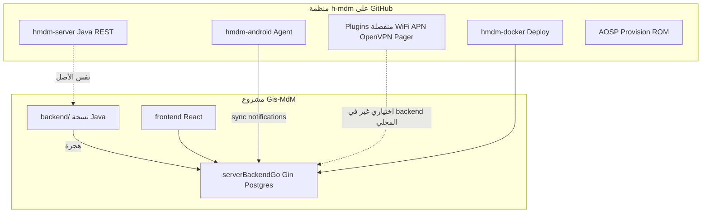

# تحليل منظمة Headwind MDM (h-mdm) وما يجب إضافته في `serverBackendGo`

**تاريخ التحليل:** 2026-05-21  
**المصدر الرسمي:** [h-mdm على GitHub — Repositories](https://github.com/h-mdm?tab=repositories)  
**الباكند القديم في هذا المشروع:** [`backend/`](backend/) (نسخة مُشتقة من [`h-mdm/hmdm-server`](https://github.com/h-mdm/hmdm-server))  
**الباكند الجديد:** [`serverBackendGo/`](serverBackendGo/)  
**مراجع داخلية:** [`JAVA-GO-BACKEND-GAPS.md`](JAVA-GO-BACKEND-GAPS.md), [`JAVA-GO-MIGRATION-STATUS.md`](JAVA-GO-MIGRATION-STATUS.md), [`serverBackendGo/docs/parity/`](serverBackendGo/docs/parity/)

---

## 1. الخلاصة التنفيذية

منظمة **[h-mdm](https://github.com/h-mdm?tab=repositories)** (Headwind MDM) تحتوي **17 مستودعاً**. منها **مستودع واحد فقط** هو لوحة التحكم وواجهة REST الكاملة: **[`hmdm-server`](https://github.com/h-mdm/hmdm-server)** — وهو ما يطابق مجلد [`backend/`](backend/) عندكم.

مشروع **`serverBackendGo`** يغطي اليوم **~30 وحدة Go** مقابل **35 مورد REST** في Java، مع تطابق سلوكي تقديري **~78–82%** (راجع [`JAVA-GO-MIGRATION-STATUS.md`](JAVA-GO-MIGRATION-STATUS.md)).

| الفئة | العدد | ماذا تفعل لـ Go |
|--------|-------|----------------|
| **يجب نقله/إكماله** (من `hmdm-server`) | REST + plugins + خلفية | **هذا هو نطاق `serverBackendGo`** |
| **عقود API فقط** (وكلاء Android) | `hmdm-android`, `pager` | لا كود Go؛ لكن **يجب الحفاظ على مسارات sync/notifications/stats** |
| **نشر وتشغيل** | `hmdm-docker` | Docker/Compose — ليس منطق تطبيق |
| **إضافات تجارية/منفصلة** | WiFi, APN, OpenVPN, … | غير موجودة في `backend/` المحلي؛ **اختيارية** لـ Go |
| **AOSP / اختبار** | Provision, LibTest, … | خارج نطاق الباكند |

**أهم ما يزال يجب إضافته في Go (مرتّب):**

1. **P0:** exports ومسارات ناقصة في plugins (`deviceinfo`, `devicelog`) + **AuditFilter** + **SyncResponseHook** + **bootstrap عميل** عند الإنشاء  
2. **P1:** إثراء بحث الأجهزة، خدمة ملفات static `/files/*` للوكلاء، quota ملفات التكوين، `uploadedfiles`  
3. **P2:** وحدة **`videos`**، تحديثات APK كاملة + `sendStats`، charts ملخص غنية  
4. **P3:** MQTT/FCM مباشر (إن فشل polling)، Mailchimp، مهام دفعات devicelog  
5. **⊘:** plugins Angular-only (`xtra`)، superadmin users، impersonate (React لا يستخدمها)

> **ملاحظة 014:** وحدة **`stats`** (`PUT /rest/public/stats`) **مُنفَّذة** في الفرع الحالي — راجع [`serverBackendGo/docs/parity/stats.md`](serverBackendGo/docs/parity/stats.md). ما زال **`videos`** غير موجود.

---

## 2. خريطة مستودعات h-mdm (17 مستودعاً)

| # | المستودع | اللغة | الدور | علاقته بـ `serverBackendGo` |
|---|----------|-------|-------|------------------------------|
| 1 | [**hmdm-server**](https://github.com/h-mdm/hmdm-server) | Java | لوحة تحكم WAR، JAX-RS، MyBatis، Liquibase، plugins مدمجة | **المصدر الرئيسي للنقل** — يطابق [`backend/`](backend/) |
| 2 | [**hmdm-android**](https://github.com/h-mdm/hmdm-android) | Java/Kotlin | Launcher/وكيل MDM على الجهاز | يستهلك `/rest/public/sync`, notifications, push — **لا ينقل إلى Go** لكن **يجب توافق API** |
| 3 | [**hmdm-android-plugin-pager**](https://github.com/h-mdm/hmdm-android-plugin-pager) | Java | إشعارات Push من اللوحة للجهاز | يعتمد على تكامل push في السيرفر؛ Go يستخدم **طابور DB + polling** |
| 4 | [**hmdm-docker**](https://github.com/h-mdm/hmdm-docker) | Shell | صورة Docker رسمية | نشر `serverBackendGo` + Postgres — **توثيق تشغيل** وليس وحدة Go |
| 5 | [**hmdm-plugin-wifimanager**](https://github.com/h-mdm/hmdm-plugin-wifimanager) | Java | إدارة WiFi من اللوحة | **غير موجود** في `backend/` المحلي؛ إضافة لاحقة إن رُكّبت |
| 6 | [**hmdm-plugin-apn**](https://github.com/h-mdm/hmdm-plugin-apn) | Java | إعداد APN | نفس الملاحظة |
| 7 | [**hmdm-openvpn**](https://github.com/h-mdm/hmdm-openvpn) | C/Java | OpenVPN كـ plugin | أذونات في SQL (`plugin_openvpn_*`)؛ **لا REST في النسخة المحلية** |
| 8 | [**launcherrestarter**](https://github.com/h-mdm/launcherrestarter) | Java | إعادة تشغيل الـ launcher بعد التحديث | لا باكند؛ يؤثر على استقرار الوكيل |
| 9 | [**LibTest**](https://github.com/h-mdm/LibTest) | Java | مثال تكامل مكتبة MDM | اختبار — خارج النطاق |
| 10 | [**AospProvision**](https://github.com/h-mdm/AospProvision) | Java | Device Owner عند أول تشغيل AOSP | enrollment يمر عبر **`/rest/public/...`** و QR — Go يغطي `qrcode` + `publicapi` |
| 11 | [**AospProvisionStudio**](https://github.com/h-mdm/AospProvisionStudio) | Java | بناء provisioning بدون مصدر AOSP كامل | نفس العلاقة |
| 12 | [**AospHmdm**](https://github.com/h-mdm/AospHmdm) | Makefile | تضمين APK في ROM | نشر — خارج Go |
| 13 | [**grapheneos-setup-wizard**](https://github.com/h-mdm/grapheneos-setup-wizard) | Kotlin | Setup Wizard + QR provisioning | يستهلك مسارات التسجيل العامة |
| 14 | [**SetupWizardProvisionTest**](https://github.com/h-mdm/SetupWizardProvisionTest) | Kotlin | اختبار provisioning | خارج النطاق |
| 15 | [**DOSharedUserTest**](https://github.com/h-mdm/DOSharedUserTest) | Java | اختبار Device Owner | خارج النطاق |
| 16 | [**FileProviderTest**](https://github.com/h-mdm/FileProviderTest) | Java | FileProvider Android 12+ | خارج Go |
| 17 | [**test-chrome-ext**](https://github.com/h-mdm/test-chrome-ext) | Python | اختبار إضافة Chrome | خارج النطاق |



---

## 3. تحليل `hmdm-server` (القلب — يطابق `backend/`)

### 3.1 هيكل المستودع الرسمي

| المسار في Java | المحتوى |
|----------------|---------|
| `server/` | WAR، `*Resource.java`، AngularJS قديم، servlets |
| `common/` | Domain، DAO/MyBatis، خدمات مشتركة |
| `jwt/` | `JWTAuthResource` |
| `notification/` | Long polling، MQTT/ActiveMQ (اختياري) |
| `plugins/` | audit, deviceinfo, devicelog, messaging, push, platform, xtra |
| `install/sql/` | `hmdm_init.*.sql` — schema أولي + بيانات seed |
| `**/liquibase/` | ترحيلات DB متعددة لكل plugin |

في **Gis-MdM**، نفس الهيكل تحت [`backend/`](backend/) مع واجهة React جديدة [`frontend/`](frontend/) بدلاً من Angular للوحة.

### 3.2 موارد REST الأساسية (35 في Java)

#### Core server — حالة النقل إلى Go

| مورد Java | المسار | وحدة Go | الحالة |
|-----------|--------|---------|--------|
| `AuthResource` | `/rest/public/auth` | `auth` | ✅ |
| `JWTAuthResource` | `/rest/public/jwt` | `auth` | ✅ |
| `SignupResource` | `/rest/public/signup` | `signup` | ⚠️ بدون Mailchimp / نسخ افتراضي كامل |
| `PasswordResetResource` | `/rest/public/passwordReset` | `passwordreset` | ✅ |
| `UserResource` | `/rest/private/users` | `users` | ⚠️ / ⊘ مسارات superadmin |
| `UserRoleResource` | `/rest/private/roles` | `roles` | ✅ |
| `CustomerResource` | `/rest/private/customers` | `customers` | ⚠️ bootstrap tenant |
| `SettingsResource` | `/rest/private/settings` | `settings` | ✅ (بعد 013/014) |
| `HintResource` | `/rest/private/hints` | `hints` | ✅ |
| `SummaryResource` | `/rest/private/summary` | `summary` | ⚠️ charts شهرية مبسّطة |
| `DeviceResource` | `/rest/private/devices` | `devices` | ⚠️ إثراء قائمة بحث |
| `GroupResource` | `/rest/private/groups` | `groups` | ✅ |
| `ConfigurationResource` | `/rest/private/configurations` | `configurations` | ✅ (بعد 014 policy JSON) |
| `ConfigurationFileResource` | `/rest/private/config-files` | `configfiles` | ⚠️ quota / uploadedfiles |
| `ApplicationResource` | `/rest/private/applications` | `applications` | ⚠️ plugin hooks |
| `FilesResource` | `/rest/private/web-ui-files` | `files` | ⚠️ static `/files/*` للوكلاء |
| `IconResource` / `IconFileResource` | icons + icon-files | `icons` | ✅ |
| `PublicResource` | `/rest/public/...` | `publicapi` | ✅ |
| `PublicFilesResource` | `/rest/public/files` | — | ⊘ |
| `SyncResource` | `/rest/public/sync` | `sync` | ⚠️ SyncResponseHook |
| `PushApiResource` | `/rest/private/push` | `push` | ✅ |
| `UpdateResource` | `/rest/public/update` | `updates` | ⚠️ APK بعيد + sendStats |
| `QRCodeResource` | `/rest/public/qr` | `qrcode` | ✅ |
| `StatsResource` | `PUT /rest/public/stats` | `stats` | ✅ **014** |
| `VideosResource` | `/rest/public/videos` | — | ❌ |
| `NotificationResource` | `/rest/notifications` | `notifications` | ✅ polling |

#### Plugins المدمجة في `hmdm-server`

| Plugin Java | Go | فجوات REST/خلفية |
|-------------|-----|------------------|
| `platform` | `plugins/platform` | ✅ |
| `audit` | `plugins/audit` | ❌ `AuditFilter` تلقائي؛ بحث فقط |
| `messaging` | `plugins/messaging` | ✅ |
| `push` | `plugins/push` + `platform/push` | ⚠️ لا MQTT مباشر؛ cron ✅ |
| `deviceinfo` | `plugins/deviceinfo` | ❌ export, search/device, settings/device |
| `devicelog` | `plugins/devicelog` | ❌ export, rules/{deviceNumber}, batch task |
| `xtra` | — | ⊘ Angular فقط |

### 3.3 مكوّنات خلفية في Java **ليست** REST (يجب مراعاتها في Go)

| المكوّن | الموقع في hmdm-server | في Go اليوم | يجب إضافته؟ |
|---------|----------------------|-------------|-------------|
| `AuditFilter` | plugins/audit | ❌ | **نعم P0** — `internal/platform/audit` middleware |
| `SyncResponseHook` | SyncResource + Guice | ❌ | **نعم P0** — registry في `platform/synchooks` |
| `PushScheduleTaskModule` | plugins/push | ✅ `app/scheduler.go` | — |
| `NotificationMqttTaskModule` | notification | ❌ | **P3** إن polling غير كافٍ |
| `InsertDeviceLogRecordsTask` | devicelog | ❌ | **P2/P3** worker دفعات |
| `DeviceInfoTaskModule` | deviceinfo | ❌ | **P2** إن لزم telemetry دوري |
| `CustomerCreatedEventListener` | platform | ❌ | **P0** عند `customers` PUT |
| `MailchimpService` | signup/customers | ❌ | **⊘ أو P3** |
| `FileCheckTask` | server | ❌ | **P2** صيانة ملفات |
| Liquibase متعدد | plugins + server | migrations `000001`–`000017` | **مراجعة** عند كل plugin جديد |

---

## 4. Plugins المنفصلة على GitHub (خارج `backend/` المحلي)

هذه المستودعات **ليست داخل** [`backend/plugins/`](backend/plugins/) في Gis-MdM، لكنها تظهر في توزيع Headwind التجاري أو في SQL seed (أذونات، جداول `plugin_*`):

| مستودع h-mdm | REST متوقع | توصية لـ `serverBackendGo` |
|--------------|------------|---------------------------|
| [hmdm-plugin-wifimanager](https://github.com/h-mdm/hmdm-plugin-wifimanager) | `/rest/plugins/.../wifi` | **مرحلة لاحقة:** وحدة `plugins/wifimanager` بعد تثبيت plugin في DB |
| [hmdm-plugin-apn](https://github.com/h-mdm/hmdm-plugin-apn) | APN setup | نفس الأسلوب |
| [hmdm-openvpn](https://github.com/h-mdm/hmdm-openvpn) | تكامل VPN | عميل Android + إعدادات؛ باكند قد يكون minimal |
| [hmdm-android-plugin-pager](https://github.com/h-mdm/hmdm-android-plugin-pager) | يعتمد `push`/`messaging` | **لا وحدة جديدة** — تأكد توافق `push` + notifications |

**قاعدة:** لا تُضاف وحدات Go لهذه الإضافات **إلا** إذا رُكّبت في قاعدة البيانات (`plugins` table) وطلبتها الواجهة أو الوكلاء.

---

## 5. مستودعات الوكلاء والنشر — متطلبات API على Go

### 5.1 `hmdm-android` (الوكيل)

يجب أن يبقى Go متوافقاً مع:

| المسار | الغرض |
|--------|--------|
| `POST /rest/public/sync` | heartbeat، إعدادات، تطبيقات |
| `GET /rest/notifications` (long poll) | رسائل للجهاز |
| `PUT /rest/public/stats` | إحصائيات نسخة MDM — **✅ بعد تفعيل `MODULE_STATS_ENABLED`** |
| `GET /rest/public/update/check` | تحديث launcher |
| ملفات التطبيقات/الأيقونات | غالباً URLs تحت `/files/` — **ناقص static serving P1** |

### 5.2 `hmdm-docker`

يُستخدم لنشر Tomcat + Postgres. لـ Go:

- استبدال WAR بـ binary `serverBackendGo`
- نفس متغيرات: `DATABASE_URL`, `FILES_DIRECTORY`, `JWT_SECRET`, flags الوحدات
- راجع [`serverBackendGo/.env.example`](serverBackendGo/.env.example)

---

## 6. ما يجب إضافته في `serverBackendGo` — خطة مفصّلة

### 6.1 وحدات REST جديدة أو غير مكتملة

| الأولوية | العنصر | مسارات Java | إجراء مقترح في Go |
|----------|--------|-------------|-------------------|
| **P2** | `VideosResource` | `POST/GET /rest/public/videos/{fileName}` | `internal/modules/videos` + `VIDEO_DIRECTORY` + `MODULE_VIDEOS_ENABLED` |
| **P0** | deviceinfo export | `POST .../private/export`, `POST .../search/device`, `GET ...-settings/device/{n}` | توسيع [`plugins/deviceinfo`](serverBackendGo/internal/modules/plugins/deviceinfo) |
| **P0** | devicelog export | `POST .../search/export`, `GET .../rules/{deviceNumber}` | توسيع [`plugins/devicelog`](serverBackendGo/internal/modules/plugins/devicelog) |

### 6.2 توسيع وحدات موجودة

| الوحدة | النقص | مرجع Java |
|--------|-------|-----------|
| `customers` | نسخ أجهزة/تكوينات/إعدادات عند إنشاء tenant | `CustomerResource` + listeners |
| `devices` | `applications`/`files` في صفوف البحث؛ فلاتر `deviceStatuses` | `DeviceResource` |
| `configfiles` | `uploadedfiles`, `sizeLimit` | `ConfigurationFileResource` |
| `files` | Gin static `GET /files/{path}` للوكلاء | servlet ملفات Java |
| `sync` | `SyncResponseHook` من plugins | `SyncResource` |
| `updates` | تنزيل APK URL + `sendStats` | `UpdateResource` |
| `summary` | سلاسل شهرية + charts per-config | `SummaryResource` + `devicestatuses` |
| `signup` | Mailchimp + defaults | `SignupResource` |
| `applications` | hooks عند الحفظ | Guice plugin platform |

### 6.3 طبقة platform (عابرة للوحدات)

| المكوّن المقترح | يعادل Java | المسار المقترح |
|-----------------|------------|----------------|
| Audit middleware | `AuditFilter` | `internal/platform/audit/` |
| Sync hooks registry | `SyncResponseHook` | `internal/platform/synchooks/` |
| Push notifier | `PushService` | ✅ موجود `internal/platform/push` |
| Scheduler | `PushScheduleTaskModule`, devicelog batch | ✅ `internal/app/scheduler.go` — **وسّع** لمهام devicelog |
| Static files | file servlet | middleware أو `files` public handler |

### 6.4 قاعدة البيانات

| البند | الحالة |
|-------|--------|
| Core + 013/014 | migrations حتى `000017` في الفرع الحالي |
| جداول plugins deviceinfo/devicelog | جزئية — راجع [`JAVA-GO-DATABASE-GAPS.md`](JAVA-GO-DATABASE-GAPS.md) |
| plugins تجارية (WiFi, APN, …) | **لا تُنشأ** إلا عند تثبيت الـ plugin |

### 6.5 ما **لا** يُنصح بنقله إلى Go (⊘)

| العنصر | السبب |
|--------|--------|
| Angular `xtra` plugin UI | React لا يستخدمه |
| `UserResource` impersonate / superadmin | React لا يستدعيها |
| `PublicFilesResource` | قديم؛ استبدل بـ files/static |
| MQTT إلزامي | Go يعمل بـ DB queue + polling — قرار تشغيل |
| Mailchimp | تسويق اختياري |
| كود `hmdm-android` / AOSP | مستودعات منفصلة |

---

## 7. جدول Endpoints — Java موجود و Go **ما زال ناقصاً**

```text
❌ POST /rest/public/videos/{fileName}
❌ GET  /rest/public/videos/{fileName}

❌ POST /rest/plugins/deviceinfo/deviceinfo/private/search/device
❌ POST /rest/plugins/deviceinfo/deviceinfo/private/export
❌ GET  /rest/plugins/deviceinfo/deviceinfo-plugin-settings/device/{deviceNumber}

❌ POST /rest/plugins/devicelog/log/private/search/export
❌ GET  /rest/plugins/devicelog/log/rules/{deviceNumber}

⚠️  (سلوك) GET static /files/* للوكلاء
⚠️  (سلوك) customers bootstrap على PUT
⚠️  (سلوك) updates POST تنزيل APK + sendStats
⚠️  (خلفية) AuditFilter على كل /rest/private/*
⚠️  (خلفية) SyncResponseHook
```

**مُنجَز مؤخراً (لا يظهر في القوائم القديمة):**

```text
✅ PUT /rest/public/stats          → internal/modules/stats (014)
✅ POST /rest/private/icon-files   → Phase 9
✅ push عند حفظ configuration      → platform/push
✅ cron push schedule              → scheduler.go
```

---

## 8. خريطة أولويات التنفيذ (موصى بها)

| المرحلة | Spec / مهام | المحتوى |
|---------|-------------|---------|
| **الآن** | [`specs/011-complete-migration-gaps/`](specs/011-complete-migration-gaps/) T046–T093 | exports, audit, sync hooks, customers bootstrap, static files |
| **التالي** | [`specs/012-finish-java-go-backend/`](specs/012-finish-java-go-backend/) | devices enrichment, videos ⊘/module, updates APK |
| **مكتمل جزئياً** | [`specs/014-complete-frontend-go-integration/`](specs/014-complete-frontend-go-integration/) | settings, configurations, stats, sync devicestatuses |
| **لاحقاً** | spec جديد `plugins-external` | WiFi/APN/OpenVPN **إن** رُكّبت في المنتج |

---

## 9. قائمة تحقق: جاهزية استبدال `hmdm-server` بـ Go

```text
[ ] UAT كامل لـ React على serverBackendGo
[ ] وكلاء: enroll → sync → notifications → (stats إن مفعّل)
[ ] plugins: deviceinfo/devicelog export إن الفريق يستخدم التقارير
[ ] audit امتثال: AuditFilter أو بديل موثّق
[ ] إنشاء عميل جديد: bootstrap أو إجراء يدوي موثّق
[ ] MODULE_STATS_ENABLED=true في الإنتاج
[ ] قرار videos: تنفيذ module أو ⊘ في parity/videos.md
[ ] لا اعتماد على MQTT إلا إن وُثّق polling كافٍ
```

---

## 10. الوحدات المسجّلة حالياً في Go

من [`serverBackendGo/internal/app/modules.go`](serverBackendGo/internal/app/modules.go):

`auth`, `signup`, `passwordreset`, `users`, `twofactor`, `roles`, `customers`, `settings`, `hints`, `summary`, `devices`, `groups`, `applications`, `configurations`, `configfiles`, `files`, `icons`, `publicapi`, **`stats`**, `sync`, `push`, `notifications`, `updates`, `qrcode`, `plugins/platform`, `plugins/audit`, `plugins/push`, `plugins/messaging`, `plugins/deviceinfo`, `plugins/devicelog`.

**غير مسجّلة:** `videos` — **مطلوبة P2** إن وُجدت روابط تدريب في الإنتاج.

---

## 11. مراجع وملفات parity

| الموضوع | ملف |
|---------|-----|
| فجوات Java↔Go (تفصيلي) | [`JAVA-GO-BACKEND-GAPS.md`](JAVA-GO-BACKEND-GAPS.md) |
| حالة الهجرة | [`JAVA-GO-MIGRATION-STATUS.md`](JAVA-GO-MIGRATION-STATUS.md) |
| تكامل React | [`FRONTEND-GO-BACKEND-INTEGRATION.md`](FRONTEND-GO-BACKEND-INTEGRATION.md) |
| فجوات DB | [`JAVA-GO-DATABASE-GAPS.md`](JAVA-GO-DATABASE-GAPS.md) |
| خارطة phases | [`serverBackendGo/docs/MIGRATION.md`](serverBackendGo/docs/MIGRATION.md) |
| كل endpoint | [`serverBackendGo/docs/parity/`](serverBackendGo/docs/parity/) (27 ملفاً) |
| منظمة h-mdm | https://github.com/h-mdm?tab=repositories |
| السيرفر الرسمي | https://github.com/h-mdm/hmdm-server |

---

*يُحدَّث هذا الملف عند: إضافة `videos`، إغلاق Phase 9، أو دمج plugins خارجية من مستودعات h-mdm المنفصلة.*
