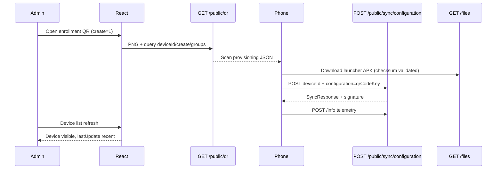

# Contract: End-to-end enrollment sequence

**Actors**: Admin (React), Go API, Android launcher / Device Owner setup, PostgreSQL, filesystem.

---

## Flow A — QR create-on-demand (primary)

**Assertions**:

1. After step QR, JSON includes `com.hmdm.CONFIG` = qr key when `create=1`.
2. After step Sync, `devices.number` = device id from phone.
3. After step Files, APK HTTP 200.
4. After step info, search finds device.

---

## Flow B — Pre-registered device

1. Admin `PUT /rest/private/devices` with `number` + `configurationId`.
2. Phone enrolls with same `number` (QR optional without `create=1`).
3. `GET or POST /public/sync/configuration/{number}` returns config.
4. No duplicate row.

---

## Flow C — Failure diagnostics

| Symptom | Check |
|---------|--------|
| QR scan does nothing | PNG JSON structure vs Java sample |
| APK download fails | `/files/...` 404, `BASE_URL` LAN-reachable |
| Sync 403 | `SECURE_ENROLLMENT`, `X-Request-Signature` |
| Sync 409 duplicate | `PREVENT_DUPLICATE_ENROLLMENT`, existing `lastupdate` |
| Device missing in UI | Wrong `configuration` key resolution; wrong customer |
| Online never shows | `POST /info` not called or `lastupdate` not updated |

---

## Parity sign-off

Update `serverBackendGo/docs/parity/qrcode.md`, `sync.md`, and add `public-files.md` (or extend `files.md`) when flows A–B pass quickstart on dev stack.
